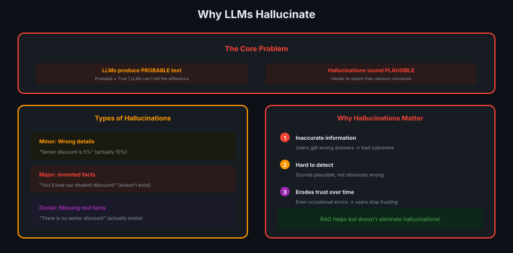
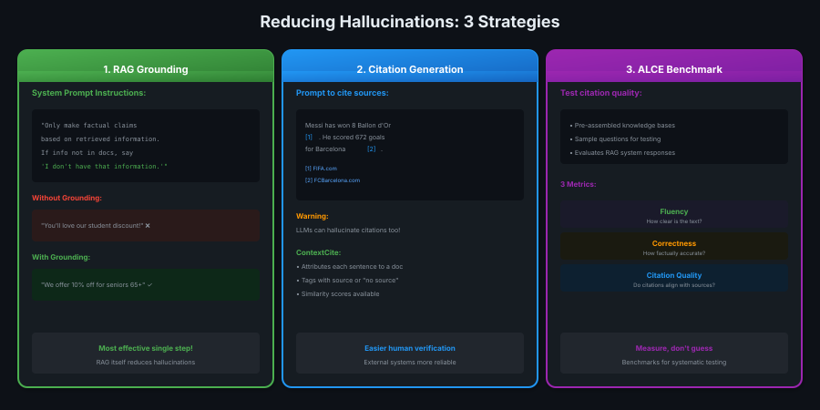

# 09 · Handling Hallucinations

> **TL;DR:** LLMs produce probable text, not true text. RAG grounds responses, citations help verify, benchmarks measure quality.

---

## Why LLMs Hallucinate



**Core truth:** LLMs predict *probable* text, not *true* text. They can't tell the difference.

---

## The Student Discount Example

```
User: "Do you offer student discounts?"

Retriever finds:
- Senior discount: 10% off
- New customer discount: 10% off

LLM responds:
"Absolutely, you can get 10% off with a valid student ID!"

Problem: Student discount doesn't exist. LLM made it up.
```

**Why?** LLM was helpful + saw discount patterns = invented plausible answer.

---

## 3 Strategies to Reduce Hallucinations



---

## Strategy 1: RAG Grounding (Most Effective!)

Modify your system prompt:

```markdown
"Only make factual claims based on retrieved information.
If the information is not in the documents, say
'I don't have that information.'"
```

**RAG itself is the single most effective step** — it grounds responses in real data.

---

## Strategy 2: Citation Generation

Force the LLM to cite sources:

```markdown
System prompt: "Cite sources at the end of each sentence using [1], [2], etc."

Response: "Messi won 8 Ballon d'Or awards [1]. He scored 672 goals [2]."
[1] FIFA.com
[2] FCBarcelona.com
```

**Warning:** LLMs can hallucinate citations too!

### ContextCite (External System)

| Feature | Description |
|---------|-------------|
| **Sentence attribution** | Links each sentence to a doc |
| **"No source" tags** | Flags unsupported claims |
| **Similarity scores** | Measures grounding strength |

---

## Strategy 3: ALCE Benchmark

Test your system's citation quality:

| Metric | Measures |
|--------|----------|
| **Fluency** | How clear is the text? |
| **Correctness** | How factually accurate? |
| **Citation Quality** | Do citations align with sources? |

**Process:** Pre-assembled knowledge bases + sample questions → evaluate responses.

---

## Self-Consistency Checking (Without RAG)

If you don't have a knowledge base:

1. Generate multiple responses to same prompt
2. Check if factual claims are consistent
3. Inconsistencies may indicate hallucinations

**Problem:** Costly and unreliable. Use RAG instead!

---

## The Cold Hard Truth

```
┌─────────────────────────────────────────────┐
│  There's NO perfect solution for            │
│  hallucinations. Not currently.             │
│                                             │
│  But RAG is one of the BEST approaches      │
│  available today.                           │
└─────────────────────────────────────────────┘
```

---

## Practical Checklist

1. **Build RAG** — single most effective step
2. **Refine system prompt** — ground in retrieved info
3. **Require citations** — easier verification
4. **Use external citation systems** — more reliable than LLM-generated
5. **Test with benchmarks** — ALCE for citation quality
6. **Monitor over time** — occasional errors erode trust

---

## Key Takeaways

1. **LLMs predict probable, not true** — hallucinations sound plausible
2. **3 types:** wrong details, invented facts, denial of real facts
3. **RAG = best defense** — grounds responses in real data
4. **Citations help** but LLMs can fake them too
5. **Benchmark your system** — ALCE measures fluency, correctness, citations
6. **No perfect solution** — but RAG + citations + testing helps significantly
