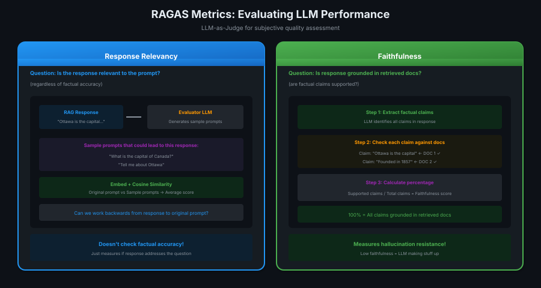

# 10 · Evaluating LLM Performance

> **TL;DR:** LLM quality is subjective — use RAGAS metrics (response relevancy, faithfulness) with LLM-as-judge to measure performance.

---

## The Challenge

LLM responsibilities in RAG are **subjective**:
- Respond clearly to the prompt
- Incorporate relevant retrieved info
- Cite sources appropriately
- Ignore irrelevant documents

**How do you measure "good enough"?** → Use other LLMs to judge!

---

## RAGAS Library Metrics



---

## Metric 1: Response Relevancy

**Question:** Is the response relevant to the user's prompt?

```
Process:
1. Take the RAG response
2. Evaluator LLM generates "sample prompts" 
   that could have led to this response
3. Embed original prompt + sample prompts
4. Calculate cosine similarity
5. Average scores = Relevancy score
```

| Score | Meaning |
|-------|---------|
| High | Can work backwards from response to prompt |
| Low | Response doesn't address the question |

**Note:** Doesn't check factual accuracy — just relevance!

---

## Metric 2: Faithfulness

**Question:** Is the response grounded in retrieved documents?

```
Process:
1. LLM extracts all factual claims from response
2. For each claim, check if it's supported by docs
3. Calculate: supported claims / total claims
```

| Score | Meaning |
|-------|---------|
| 100% | All claims grounded in docs |
| Low | LLM making stuff up (hallucinating) |

**This is your hallucination detector!**

---

## Other RAGAS Metrics

| Metric | Measures |
|--------|----------|
| **Noise Sensitivity** | Ignores irrelevant retrieved docs |
| **Citation Accuracy** | Citations align with actual sources |
| **Context Precision** | Retrieved docs actually useful |

**Common thread:** All rely on LLM-as-judge at some point.

---

## A/B Testing with User Feedback

If users can rate responses (thumbs up/down):

```
1. Baseline: Current system prompt
2. Variant: Modified system prompt
3. Isolate changes to LLM settings only
4. Measure impact on user satisfaction
5. Attribute changes to LLM modifications
```

**System-wide metric, but isolate LLM changes.**

---

## LLM's Job in RAG (Checklist)

| Responsibility | Metric to Use |
|----------------|---------------|
| Respond to prompt | Response Relevancy |
| Use retrieved info | Faithfulness |
| Cite sources | Citation metrics |
| Ignore noise | Noise Sensitivity |

**If problem is retriever, don't waste time on LLM prompts!**

---

## Key Takeaways

1. **LLM quality is subjective** — hard to measure objectively
2. **RAGAS library** — open-source RAG evaluation metrics
3. **Response Relevancy** — does response address the question?
4. **Faithfulness** — is response grounded in docs? (hallucination check)
5. **LLM-as-judge** — all metrics use LLMs to assess quality
6. **A/B test** — user feedback for system-wide impact
