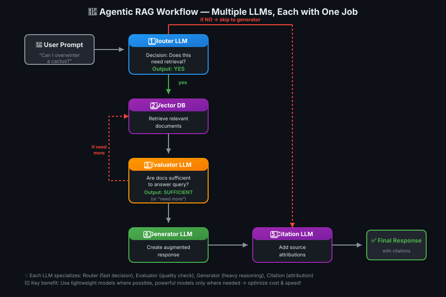
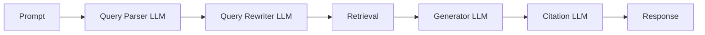
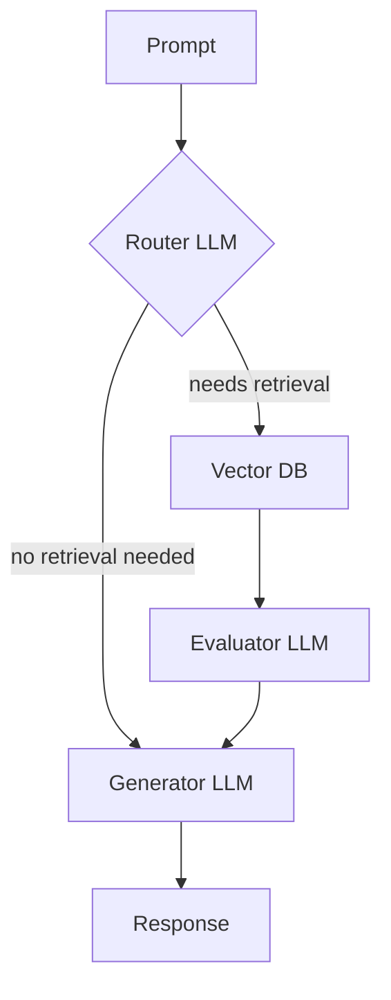
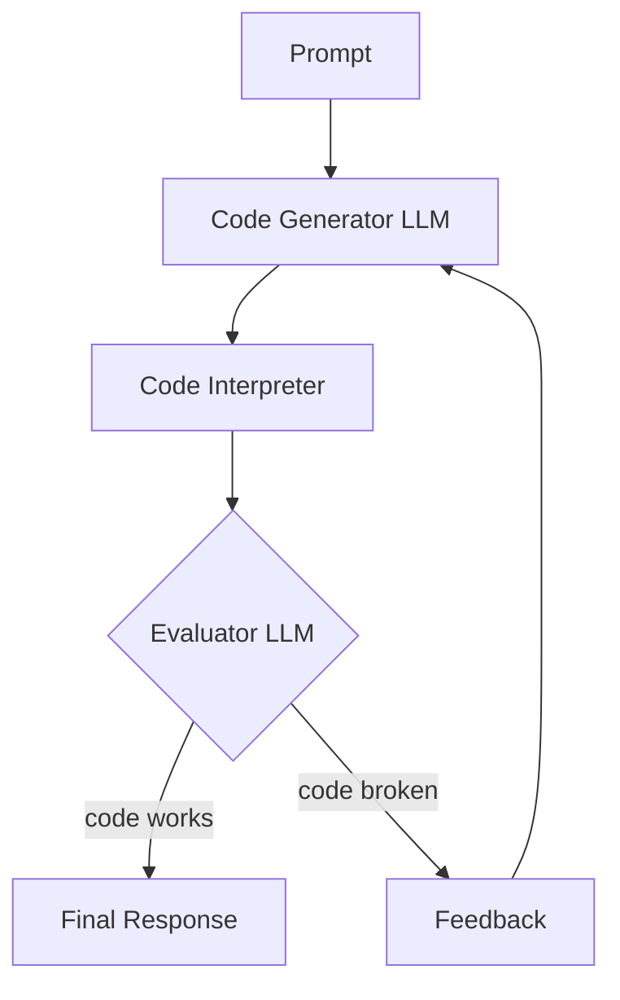
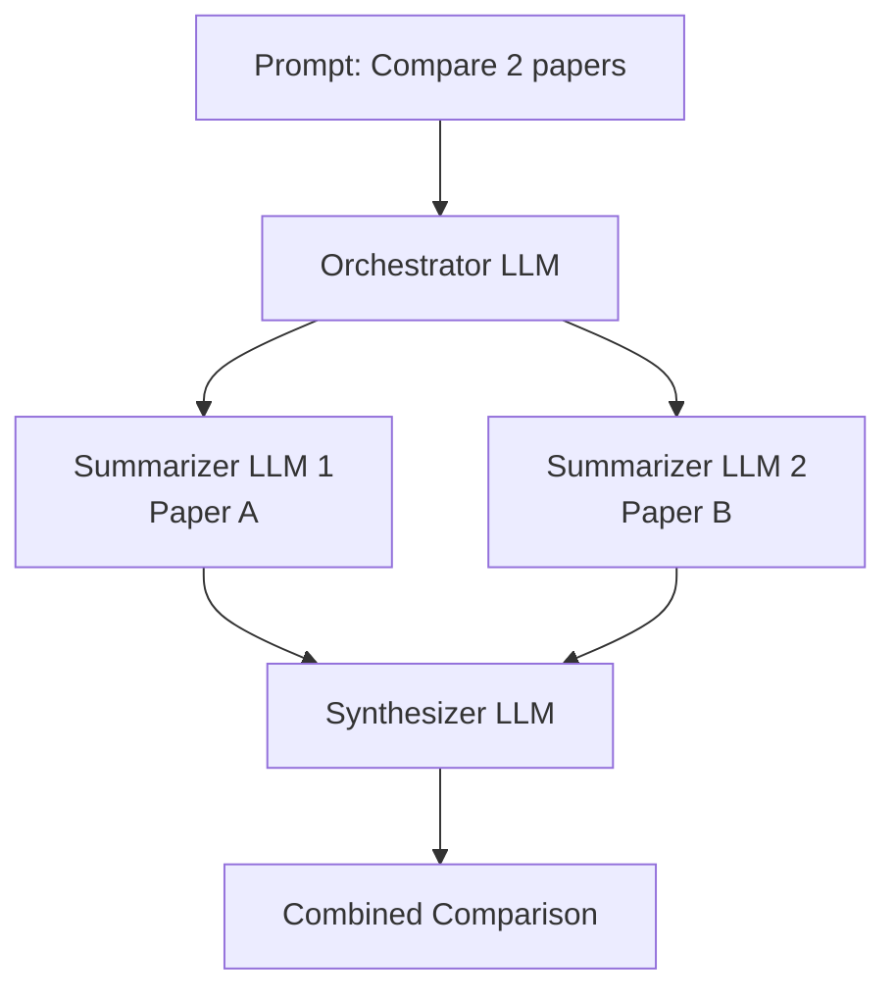

# 11 — Agentic RAG

> LLMs ko decision-making powers do! Multiple LLMs, har ek apna specialist role play karte hue 🤖

---

## What is Agentic RAG?

**Agentic workflow** = using **multiple LLMs** throughout your RAG system, each one responsible for a **single step** in the overall process.

Instead of one LLM doing everything, you break the workflow into specialized tasks:
- Router LLM → decides if retrieval is needed
- Evaluator LLM → checks if retrieved docs are sufficient
- Generator LLM → creates the response
- Citation LLM → adds source attribution

> 💡 **Ek rasoiya sab nahi kar sakta!** Restaurant mein chef alag, waiter alag, manager alag — har koi apne kaam mein expert. Agentic RAG = specialized LLMs, har step pe ek alag model! 👨‍🍳

---

## Two Main Changes from Simple RAG

| # | Change | What It Means |
|---|--------|---------------|
| 1️⃣ | **Tasks = series of steps & decisions** | Each step completed by a **different LLM call** |
| 2️⃣ | **LLMs get access to tools** | Code interpreter, web browser, **vector database** |

---

## Example Agentic RAG Workflow

### Step-by-Step Flow

| Step | Component | Role | Output |
|------|-----------|------|--------|
| 1 | **Router LLM** | Does this prompt need retrieval? | `yes` or `no` |
| 2a | **Vector DB** | (if yes) Retrieve documents | Top-k docs |
| 2b | **Skip retrieval** | (if no) Go directly to generator | — |
| 3 | **Evaluator LLM** | Are retrieved docs sufficient? | `sufficient` or `need more` |
| 4 | **Loop back** | (if need more) Request additional retrievals | More docs |
| 5 | **Generator LLM** | Create response from augmented prompt | Draft response |
| 6 | **Citation LLM** | Add source attributions | Final response with citations |

---

## Key Principles of Agentic Systems

### 1. Flowchart Thinking

Design an agentic system = **draw a flowchart**. Each LLM is a node:
- Takes **text input**
- Produces **text output**
- Performs **one specific task**

### 2. Different LLMs for Different Steps

You **don't need the same LLM** for every step!

| Task | Model Choice | Why |
|------|-------------|-----|
| Router LLM | **Lightweight, fast** (e.g., Haiku, small model) | Simple yes/no decision |
| Evaluator LLM | **Lightweight, fast** | Simple sufficiency check |
| Generator LLM | **Larger, capable** (e.g., GPT-4, Claude Opus) | Complex reasoning & generation |
| Citation LLM | **Specialized model** | Good at source attribution |

**Cost & speed benefits:** Router runs 100×/day but costs pennies. Generator runs 10×/day but costs more — optimize each step independently!

> 💡 **Delivery boy ko PhD nahi chahiye!** Router = just "haan ya na" bolna hai. Generator = full essay likhna hai. Dono ke liye same PhD professor ko kyun bulayein? Small model fast + cheap, big model powerful + expensive — sahi jagah pe sahi tool! 🚴‍♂️🚗

---

## Common Agentic Workflow Patterns

### 1️⃣ Sequential Workflow

**Linear chain** — output moves through LLMs one by one.

**Use when:** Every prompt follows the same pipeline. Each LLM specializes at one step.

---

### 2️⃣ Conditional Workflow

**Router decides which path** to take.

**Use when:** Not every prompt needs the same steps (e.g., some need retrieval, some don't).

**Example:** Router could also pick between multiple specialized LLMs:
- Medical LLM for health questions
- Legal LLM for law questions
- General LLM for everything else

---

### 3️⃣ Iterative Workflow

**Loops back** to earlier points in the system until a condition is met.

**Use when:** Task requires multiple attempts to get right (e.g., code generation, query refinement).

**Example (RAG for code):**
1. Generate code that integrates with existing codebase
2. Run code interpreter to test it
3. Evaluator LLM checks if it works
4. If broken → provide feedback → try again (loop)
5. If working → return final code

---

### 4️⃣ Parallel Workflow

**Orchestrator breaks task** into subtasks → assigns to separate LLMs → **Synthesizer combines** results.

**Use when:** Task can be split into independent subtasks that can run in parallel.

**Example:** "Compare insights from Research Paper A and Research Paper B"
- LLM 1 summarizes Paper A
- LLM 2 summarizes Paper B
- Synthesizer LLM combines findings into a comparison

---

## Building Agentic Systems — Tools & Mindset

### Implementation Approaches

| Complexity | Approach | When to Use |
|------------|----------|-------------|
| **Simple** | Write your own logic | 2-4 LLMs, clear flowchart, deterministic routing |
| **Complex** | Use agentic frameworks | 5+ LLMs, dynamic routing, tool use, state management |

**Popular frameworks:**
- LangGraph (LangChain)
- AutoGen (Microsoft)
- CrewAI
- LlamaIndex agents

---

### Mindset Shift: LLMs as Modular Pieces

> 🔧 **LLMs = LEGO blocks**, not monolithic solutions.

Before agentic systems:
- "I need one powerful LLM to do everything"

After agentic systems:
- "I need the **right LLM for each step**"
- Small models for simple decisions
- Large models for complex reasoning
- Specialized models for niche tasks

**Flexibility unlocked:** Mix and match based on:
- Task complexity
- Speed requirements
- Cost constraints
- Accuracy needs

> 💡 **Swiss Army knife vs toolbox!** Ek hi model se sab karna = Swiss Army knife (good at nothing, okay at everything). Agentic = proper toolbox — hammer for nails, screwdriver for screws, saw for cutting. Right tool = right job! 🔨🔧🪛

---

## Benefits of Agentic RAG

| Benefit | Why It Matters |
|---------|----------------|
| **💰 Cost optimization** | Use cheap models for simple steps, expensive models only where needed |
| **⚡ Speed gains** | Router + evaluator = lightweight & fast. Don't run heavy LLM unnecessarily |
| **🎯 Better quality** | Each LLM specializes → does its job better than generalist |
| **🔧 Easier debugging** | Know exactly which step failed. Fix one component without touching others |
| **📈 Scalability** | Add new steps (e.g., fact-checker LLM) without redesigning entire system |

---

## When to Use Agentic RAG

| Use Agentic RAG When... | Stick with Simple RAG When... |
|------------------------|-------------------------------|
| Not every query needs retrieval | Every query needs retrieval |
| Multiple specialized tasks (routing, evaluation, generation) | One-step process (retrieve → generate) |
| Cost/speed matter (optimize per step) | Simplicity matters more |
| Building complex systems (code gen, multi-step reasoning) | Building basic Q&A chatbot |
| Need iterative refinement (loops) | One-shot generation is fine |

---

## Key Takeaways

| # | Insight |
|---|---------|
| 1️⃣ | **Agentic RAG = multiple LLMs, each with one job** (router, evaluator, generator, etc.) |
| 2️⃣ | **Design = flowchart thinking** — map out steps, assign LLMs to nodes |
| 3️⃣ | **Different models for different steps** — lightweight for decisions, powerful for generation |
| 4️⃣ | **4 patterns: Sequential, Conditional, Iterative, Parallel** — pick based on task structure |
| 5️⃣ | **LLMs become modular pieces** — mix & match for cost, speed, accuracy |
| 6️⃣ | **Frameworks help at scale** — LangGraph, AutoGen, CrewAI for complex agentic systems |

> 💡 **One-liner:** Agentic RAG = assembly line for AI — har station pe ek specialist, sab milke perfect product banate hain! 🏭✨
