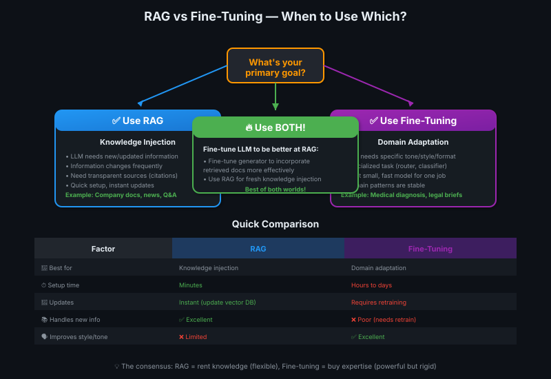

# 12 — RAG vs Fine-Tuning

> Knowledge injection vs domain specialization — kab kya use karein? 🤔

---

## What is Fine-Tuning?

**Fine-tuning** = retraining an off-the-shelf LLM with your own data to **update its internal parameters** for better performance in a specific context.

Instead of augmenting the prompt (RAG), you **retrain the model itself**.

| RAG | Fine-Tuning |
|-----|-------------|
| Add context to prompt | Retrain model parameters |
| No model changes | Model weights updated |
| Works immediately | Requires training time |

> 💡 **RAG = cheat sheet in exam 📄. Fine-tuning = actually studying and memorizing textbook 📚.** Cheat sheet instant but limited. Studying takes time but knowledge stays inside brain!

---

## How Fine-Tuning Works

### Supervised Fine-Tuning (SFT)

**Core idea:** Retrain a language model using a **labeled dataset** from your target domain.

**Instruction fine-tuning** = dataset includes:
1. **Instructions** (prompts/questions)
2. **Ground truth answers** (expected best responses)

### Training Process


| Step | What Happens |
|------|--------------|
| 1 | Feed model an instruction from your dataset |
| 2 | Model generates a response |
| 3 | Compare response to ground truth answer |
| 4 | Adjust model's **internal parameters** to align better with correct answer |
| 5 | Repeat for entire dataset (multiple epochs) |

**Similar to original training**, but dataset is domain-specific (medical, legal, code, etc.)

---

## Example: Healthcare Fine-Tuning

### Before Fine-Tuning

**Prompt:** "I have joint pain, skin rash, and sun sensitivity. What could this be?"

**Generic LLM response:**
> "You might have arthritis or a skin condition. Consult a doctor for proper diagnosis."

❌ Generic tone, vague answer, no medical expertise

---

### After Fine-Tuning (Medical Domain)

**Same prompt:** "I have joint pain, skin rash, and sun sensitivity. What could this be?"

**Fine-tuned medical LLM response:**
> "Based on your symptoms (joint pain + photosensitive rash), you may have **lupus erythematosus**. These are classic symptoms. However, proper diagnosis requires:
> - ANA (antinuclear antibody) blood test
> - Anti-dsDNA test
> - Complete blood count
> Please consult a rheumatologist immediately."

✅ Domain-specific terminology, accurate diagnosis, professional tone, actionable next steps

---

## What Fine-Tuning Changes

| Aspect | Impact |
|--------|--------|
| **📝 Style & tone** | How model responds (formal vs casual, medical vs legal language) |
| **🏗️ Structure** | Output format (bullet points, paragraphs, JSON, specific templates) |
| **🎯 Domain expertise** | Better performance **within target domain** |
| **🗣️ Word choice** | Uses domain-appropriate vocabulary (medical terms, legal jargon, code patterns) |

### What Fine-Tuning Does NOT Do Well

❌ **Teaching new information** — Fine-tuning is NOT great for knowledge injection

**Why?** Fine-tuning affects **how** the model responds more than **what** it knows.

> 💡 **Fine-tuning = teaching cooking style 👨‍🍳. RAG = giving new ingredients 🥗.** Fine-tuning teaches Italian cooking technique, but if you need info about Thai spices (new knowledge), RAG gives you the recipe book on the spot!

---

## RAG vs Fine-Tuning — When to Use Which



### The Current Consensus

| Use Case | Best Solution | Why |
|----------|--------------|-----|
| **Knowledge injection** | ✅ **RAG** | LLM needs access to **new information** not in training data |
| **Domain adaptation** | ✅ **Fine-tuning** | LLM needs to specialize in **style, tone, format** for a domain |
| **Specific task specialization** | ✅ **Fine-tuning** | LLM performs **one discrete task** (routing, classification) |
| **Dynamic knowledge** | ✅ **RAG** | Information changes frequently (news, docs, company data) |
| **Static domain expertise** | ✅ **Fine-tuning** | Domain patterns are stable (medical diagnosis, legal brief structure) |

---

## Detailed Comparison Table

| Factor | RAG | Fine-Tuning |
|--------|-----|-------------|
| **🎯 Best for** | Knowledge injection | Domain adaptation |
| **💾 Knowledge source** | External (vector DB) | Internal (model parameters) |
| **⏱️ Setup time** | Minutes | Hours to days |
| **💰 Cost** | Pay per retrieval + generation | Upfront training cost + inference |
| **🔄 Updates** | Instant (update vector DB) | Requires retraining |
| **📚 Data requirements** | Just documents | Labeled instruction-response pairs |
| **🎭 Handles new info** | ✅ Excellent | ❌ Poor (needs retraining) |
| **🗣️ Improves style/tone** | ❌ Limited | ✅ Excellent |
| **⚡ Inference speed** | Slower (retrieval step) | Faster (no retrieval) |
| **🔍 Transparency** | High (see retrieved docs) | Low (black box) |

---

## When Fine-Tuning Makes Sense

### 1️⃣ Small Models in Agentic Systems

**Scenario:** Router LLM that only decides "retrieval needed: yes/no"

**Why fine-tune?**
- Task is simple and **highly specialized**
- Want a **tiny, fast model** (cost + speed)
- Don't care about general capabilities
- Happy to sacrifice breadth for depth

**Example:**
```python
# Router LLM (fine-tuned on 10k examples)
# Only outputs: "yes" or "no"
# Model size: 1B parameters (tiny!)
# Cost: $0.0001 per call
```

---

### 2️⃣ Domain-Specific Response Format

**Scenario:** Legal assistant that ALWAYS responds in specific brief format

**Why fine-tune?**
- Output structure is **consistent and domain-specific**
- Want professional legal tone automatically
- Reduce need for complex prompt engineering

---

### 3️⃣ Proprietary/Sensitive Domains

**Scenario:** Company-internal coding patterns, proprietary APIs

**Why fine-tune?**
- Can't use RAG (sensitive code can't be in vector DB)
- Want model to "know" internal patterns intrinsically
- One-time training is more secure than repeated retrieval

---

## Using RAG + Fine-Tuning Together

**You can use BOTH!** They're complementary, not competing.

### Pattern: Fine-Tune for RAG Specialization

**Idea:** Fine-tune your generator LLM to be **better at incorporating retrieved information**.

| Without Fine-Tuning | With Fine-Tuning (for RAG) |
|---------------------|---------------------------|
| Sometimes ignores retrieved docs | Always incorporates retrieved docs properly |
| Inconsistent citation format | Consistent citation style |
| Generic response tone | Domain-appropriate tone + accurate content |

**Training data for fine-tuning:**
- Prompts + retrieved docs + ground truth responses
- Teaches model to **synthesize retrieved info effectively**

### Example Combinations

| Component | Technique | Purpose |
|-----------|-----------|---------|
| Router LLM | **Fine-tuned** | Lightweight, specialized routing decision |
| Retriever | **RAG** | Find relevant docs from vector DB |
| Generator LLM | **Fine-tuned for RAG** | Generate in medical domain style + incorporate retrieved docs well |
| Citation LLM | **Fine-tuned** | Add citations in company-standard format |

> 💡 **Best of both worlds = cricket mein batting + bowling dono strong! 🏏** RAG for fresh knowledge, fine-tuning for domain expertise. Together = unbeatable team!

---

## Fine-Tuning — Practical Considerations

### Where to Get Fine-Tuned Models

| Source | When to Use |
|--------|-------------|
| **Pre-trained domain models** | Someone already fine-tuned for your domain (Hugging Face, OpenAI) |
| **DIY fine-tuning** | Need custom domain, have labeled data + compute resources |
| **Fine-tuning-as-a-service** | Want custom fine-tuning without managing infrastructure (OpenAI, Anthropic) |

**Recommendation:** Check model repositories first (Hugging Face, Model Zoo) — might find ready-made solution!

### Cost of Fine-Tuning

| Cost Type | RAG | Fine-Tuning |
|-----------|-----|-------------|
| **Setup** | Low (vector DB setup) | High (training compute) |
| **Per-request** | Higher (retrieval + generation) | Lower (just generation) |
| **Updates** | Free (update DB) | High (retrain model) |

**Break-even:** If updates are rare + high query volume → fine-tuning wins. If updates are frequent → RAG wins.

---

## Trade-offs: Performance in Other Domains

### ⚠️ Fine-Tuning Side Effect

**Fine-tuning improves target domain but can DECREASE performance in other domains.**

| Domain | Before Fine-Tuning | After Medical Fine-Tuning |
|--------|-------------------|--------------------------|
| Medical questions | 😐 Generic | ✅ Excellent |
| Legal questions | 😐 Generic | ❌ Worse (parameters optimized for medical, not legal) |
| Cooking questions | 😐 Generic | ❌ Worse |

**Why?** Model parameters are adjusted to **optimize for one domain** — other domains suffer.

**Solution:** If you need multi-domain, either:
1. Use RAG (no parameter changes)
2. Fine-tune separate models per domain + use router

---

## Key Takeaways

| # | Insight |
|---|---------|
| 1️⃣ | **RAG = knowledge injection. Fine-tuning = domain adaptation.** Different goals, different tools. |
| 2️⃣ | **Fine-tuning changes HOW model responds** (style, tone, format) more than WHAT it knows |
| 3️⃣ | **RAG wins for new/dynamic information** — update vector DB instantly vs expensive retraining |
| 4️⃣ | **Fine-tuning wins for task specialization** — small fast models for single jobs (router, classifier) |
| 5️⃣ | **Use both together** — fine-tune generator to be better at RAG, use RAG for knowledge |
| 6️⃣ | **Fine-tuning has side effects** — improves target domain, may hurt other domains |
| 7️⃣ | **Check pre-trained models first** — someone may have already fine-tuned for your domain! |

> 💡 **One-liner:** RAG vs Fine-tuning = renting vs buying. RAG = rent knowledge on-demand (flexible, instant updates). Fine-tuning = buy expertise once (upfront cost, permanent but rigid). Smart developers use both! 🏠🔑

---

## Further Learning

To dive deeper into fine-tuning:
- Take a dedicated fine-tuning course
- Explore instruction-tuning datasets
- Try fine-tuning-as-a-service platforms (OpenAI, Anthropic, Hugging Face)
- Check Hugging Face model hub for pre-tuned models in your domain
