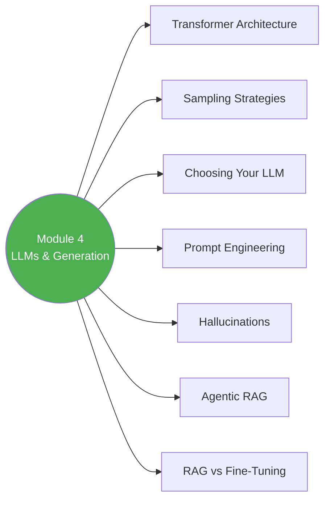

# 🤖 Module 4 — LLMs & Text Generation

> Transformers se lekar prompt engineering tak — generation side of RAG! ✨

---

## 🧠 Brain — Module Overview

## 📊 Progress

| # | Lesson | Confidence | Revised |
|---|--------|-----------|---------|
| 01 | [Module 4 Introduction](01-module-introduction.md) | 🔴 | — |
| 02 | [Transformer Architecture](02-transformer-architecture.md) | 🔴 | — |
| 03 | [LLM Sampling Strategies](03-llm-sampling-strategies.md) | 🔴 | — |
| 04 | [Exploring LLM Capabilities](04-exploring-llm-capabilities.md) | 🔴 | — |
| 05 | [Choosing Your LLM](05-choosing-your-llm.md) | 🔴 | — |
| 06 | [Prompt Engineering: Augmented Prompt](06-prompt-engineering-augmented.md) | 🔴 | — |
| 07 | [Prompt Engineering: Advanced Techniques](07-prompt-engineering-advanced.md) | 🔴 | — |
| 08 | [Prompt Engineering (Lab)](08-prompt-engineering-lab.md) | 🔴 | — |
| 09 | [Handling Hallucinations](09-handling-hallucinations.md) | 🔴 | — |
| 10 | [Evaluating Your LLM's Performance](10-evaluating-llm-performance.md) | 🔴 | — |
| 11 | [Agentic RAG](11-agentic-rag.md) | 🔴 | — |
| 12 | [RAG vs Fine-Tuning](12-rag-vs-finetuning.md) | 🔴 | — |
| 13 | [Lab: Developing a RAG Chatbot](13-lab-rag-chatbot.md) | 🔴 | — |

**Overall confidence:** 🔴 Not started

## 🧩 Memory Fragments
> - _Add fragments as you learn..._

---

## 🎬 Teach Mode

| # | Lesson | What You'll Get |
|---|--------|-----------------|
| 01 | Module 4 Introduction | Module roadmap |
| 02 | Transformer Architecture | Attention mechanism, encoder-decoder |
| 03 | Sampling Strategies | Temperature, top-k, top-p |
| 04 | LLM Capabilities | What LLMs can and can't do |
| 05 | Choosing Your LLM | Model selection criteria |
| 06 | Prompt Engineering: Augmented | Building context-rich prompts |
| 07 | Prompt Engineering: Advanced | Few-shot, chain-of-thought, etc. |
| 08 | Prompt Engineering Lab | Hands-on prompt crafting |
| 09 | Hallucinations | Causes, detection, mitigation |
| 10 | Evaluating LLMs | Measuring generation quality |
| 11 | Agentic RAG | RAG + agents = dynamic retrieval |
| 12 | RAG vs Fine-Tuning | When to use which |
| 13 | Lab: RAG Chatbot | Build an end-to-end chatbot |

**Supporting:** [Flashcards](flashcards.md)

---

## 📚 Source
> 🎓 [RAG Course — Module 4](https://learn.deeplearning.ai/courses/retrieval-augmented-generation) — DeepLearning.AI

## 🔗 Connected Topics
> ← [Module 3: Vector Databases](../module-3-ir-vector-databases/) · → [Module 5: RAG in Production](../module-5-rag-production/) · [Agentic AI](../../agentic-ai/)
