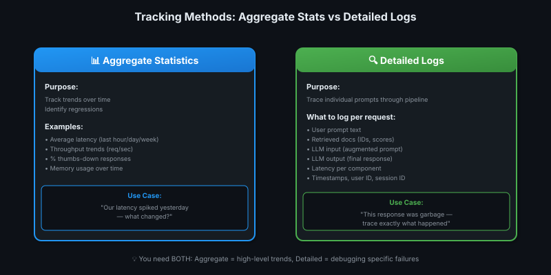
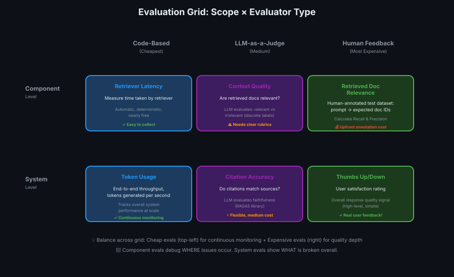

# 02 — Observability & Evaluation Systems

> Production mein andhe mat chalo — metrics, logs, aur experiments se roshni do! 📊🔍

---

## What is Observability?

**Observability** = your ability to understand what's happening inside your RAG system by examining its outputs.

**First step to handling production challenges:** Build a robust observability system.

> 💡 **Dashboard vs driving blind!** Observability = car ka dashboard — speed, fuel, engine temp sab dikh raha hai. Bina dashboard = andhe hokar gaadi chalana. Production mein dashboard zaruri hai! 🚗📊

---

## Core Components of Observability Platform

An observability system needs **4 core capabilities:**

| # | Component | Purpose |
|---|-----------|---------|
| 1️⃣ | **Performance Metrics** | Track latency, throughput, memory, compute |
| 2️⃣ | **Quality Metrics** | Measure user satisfaction, retriever recall, LLM quality |
| 3️⃣ | **Data Collection & Reporting** | Aggregate stats (trends) + detailed logs (individual traces) |
| 4️⃣ | **Experimentation** | A/B testing, secure experiments before production rollout |

---

## 1️⃣ Software Performance Metrics

**What to track:** Raw system performance

| Metric | What It Measures | Why It Matters |
|--------|------------------|----------------|
| **Latency** | Time from request → response | Users won't wait (< 2s ideal for chatbots) |
| **Throughput** | Requests handled per second | Scaling capacity (can you handle 1000 concurrent users?) |
| **Memory usage** | RAM consumption | Infrastructure cost + crash prevention |
| **Compute usage** | CPU/GPU utilization | Cost optimization |
| **Tokens/second** | Generation speed | LLM efficiency |

**How it's collected:** Code-based (cheap, automatic, deterministic)

---

## 2️⃣ Quality Metrics

**What to track:** Does the system produce **good outputs**?

Quality ≠ speed. You can be fast but wrong!

### System-Level Quality

| Metric | What It Measures | How to Collect |
|--------|------------------|----------------|
| **User satisfaction** | Overall happiness | Thumbs up/down, ratings |
| **Response quality** | Helpfulness, accuracy | Human feedback or LLM-as-a-judge |
| **Citation accuracy** | Are sources correct? | LLM-as-a-judge (RAGAS) |

### Component-Level Quality

| Component | Metric | How to Collect |
|-----------|--------|----------------|
| **Retriever** | Recall, Precision | Human-annotated test dataset (prompt → expected docs) |
| **LLM** | Response relevancy, faithfulness | LLM-as-a-judge (RAGAS library) |
| **LLM** | Noise filtering | Does it ignore irrelevant docs? (RAGAS) |

---

## 3️⃣ How to Track: Aggregate vs Detailed

### Aggregate Statistics

**Purpose:** Track **trends** over time, identify regressions

- Average latency over last hour/day/week
- Throughput trends (requests/sec)
- % of thumbs-down responses

**Use case:** "Our latency spiked yesterday — what changed?"

---

### Detailed Logs

**Purpose:** Trace **individual prompts** through the entire pipeline

**What to log per request:**
- User prompt
- Retrieved documents (IDs, scores)
- LLM input (augmented prompt)
- LLM output (response)
- Latency per component (retriever: 200ms, LLM: 1.5s)
- Timestamps, user ID, session ID

**Use case:** "This specific response was garbage — let me trace exactly what happened"

> 💡 **Highway traffic report vs dashcam footage!** Aggregate stats = traffic report ("average speed 60 km/h"). Detailed logs = dashcam ("this car cut me off at 3:42 PM"). Need both! 🚗📹

---

## 4️⃣ Experimentation

**Purpose:** Test changes **before** rolling out to all users

### Two Modes

| Mode | When to Use |
|------|-------------|
| **Secure sandbox** | Test new LLM, system prompt, or retriever settings offline |
| **A/B testing** | Roll out change to 10% of users, compare metrics vs control group |

**What to monitor:**
- Does new LLM improve quality? (measure RAGAS scores)
- Does tweaked prompt reduce latency? (measure response time)
- Does new retriever hurt recall? (measure retrieval metrics)

**Decision rule:** If metrics improve → promote to production. If they worsen → rollback.

---

## Evaluation Framework: 2D Grid (Scope × Evaluator Type)

### Dimension 1: Scope

| Scope | Purpose | Example |
|-------|---------|---------|
| **System-level** | Overall performance summary | End-to-end latency |
| **Component-level** | Debug source of issues | Retriever latency, LLM latency |

**Why both?** System-level tells you **WHAT** is broken. Component-level tells you **WHERE** and **WHY**.

---

### Dimension 2: Evaluator Type

| Type | Cost | Flexibility | Examples |
|------|------|-------------|----------|
| **Code-based** | 💰 Cheapest | 🔒 Rigid | Latency, throughput, unit tests, JSON validation |
| **LLM-as-a-judge** | 💰💰 Medium | 🔧 Flexible | Document relevance, citation quality, response relevancy |
| **Human feedback** | 💰💰💰 Expensive | ✨ Most accurate | Thumbs up/down, text feedback, manual quality review |

---

## 3 Evaluator Types in Detail

### 🤖 Code-Based Evaluators

**Characteristics:**
- **Automatic** — no human input
- **Deterministic** — same input = same output
- **Nearly free** to run

**Examples:**
- Recording prompts per second
- Unit tests (e.g., "Does LLM output valid JSON?")
- Memory/CPU usage tracking
- Token counting

**When to use:** Performance metrics, simple validation checks

---

### 👨‍⚖️ LLM-as-a-Judge

**Characteristics:**
- **Flexible** — can evaluate nuanced quality dimensions
- **Cheaper than humans** but not free
- **Needs careful tuning** (clear rubrics, discrete labels)

**How it works:**
1. Give evaluator LLM a rubric (e.g., "Is this document relevant to the query?")
2. Feed it: user prompt + retrieved doc
3. LLM outputs: `relevant` or `irrelevant`

**Best practices:**
- Use **discrete labels** (relevant/irrelevant) > continuous scores (0-100)
- Provide **clear rubrics** (define what "relevant" means)
- Watch for **model bias** (models favor their own family's outputs)

**Examples:**
- Context quality (are retrieved docs relevant?)
- Citation accuracy (do citations match sources?)
- Response relevancy (does answer address the question?) ← RAGAS

> 💡 **Teacher checking homework vs answer key!** Code-based = answer key (strict, deterministic). LLM-as-a-judge = teacher grading essay (subjective but cheaper than hiring human graders). Human feedback = principal reviewing final exams! 👨‍🏫✅

---

### 👤 Human Feedback

**Characteristics:**
- **Most costly** (time + money)
- **Captures what code misses** (nuance, context, user intent)
- **Some evals need upfront work**, others are ongoing

**Types:**

| Type | When Work Happens | Example |
|------|-------------------|---------|
| **Real-time** | Ongoing (users provide feedback) | Thumbs up/down, text comments |
| **Pre-compiled** | Upfront (humans create test set once) | Human-annotated dataset (prompt → expected docs) |
| **Manual review** | Ongoing (humans review outputs) | Quality audits, spot-checking responses |

**Examples:**
- **Thumbs up/down** ratings on responses
- **Text feedback** box ("This answer was wrong because...")
- **Human-annotated test datasets** for retriever (prompt → list of relevant doc IDs)
- **Manual quality assessments** (hire QA team to review 100 responses/week)

---

## Recommended Starter Metrics

A **simple but comprehensive** observability setup:

### For Each Major Component + Overall System

| Component | Performance Metrics (Code-Based) | Quality Metrics (Human or LLM-as-a-Judge) |
|-----------|----------------------------------|-------------------------------------------|
| **Retriever** | Latency, throughput | Recall, Precision (human-annotated test set) |
| **LLM** | Latency, tokens/sec, memory | Response relevancy, citation quality, noise filtering (RAGAS) |
| **Overall System** | End-to-end latency, throughput, token usage | Thumbs up/down (user feedback) |

**Why this balance?**
- ✅ Cheap evals (latency, throughput) = continuous monitoring
- ✅ Expensive evals (human annotation, LLM-as-a-judge) = periodic quality checks
- ✅ Both component + system = debug WHERE issues occur

---

## The Evaluation Grid — Examples

| Scope | Code-Based | LLM-as-a-Judge | Human Feedback |
|-------|------------|----------------|----------------|
| **Component** | Retriever latency | Context quality (doc relevance) | Retrieved doc relevance (pre-annotated dataset) |
| **System** | Token usage, throughput | Citation accuracy | Thumbs up/down on responses |

**How to read this:**
- **Top-right (Human + System)** = Thumbs up/down → high-level quality signal
- **Bottom-left (Code + Component)** = Retriever latency → pinpoint bottleneck
- **Middle (LLM-as-a-judge + Component)** = Context quality → debug retrieval without human cost

---

## Popular Observability Platforms

| Platform | Type | Features |
|----------|------|----------|
| **Phoenix by Arize** | Open-source | System-wide + component metrics, logging, experimentation |
| **LangSmith** (LangChain) | Commercial | Tracing, evaluation, datasets, A/B testing |
| **W&B Prompts** (Weights & Biases) | Commercial | LLM monitoring, prompt versioning, evals |
| **MLflow** | Open-source | Experiment tracking, model registry |

**Phoenix characteristics (from slides):**
- Captures system-wide + component-level metrics
- Logs system traffic
- Enables experimentation with new settings
- Open-source observability & evaluation

---

## Key Takeaways

| # | Insight |
|---|---------|
| 1️⃣ | **4 core components:** Performance metrics, quality metrics, data collection (aggregate + detailed), experimentation |
| 2️⃣ | **Performance ≠ Quality** — fast but wrong = bad. Track both separately! |
| 3️⃣ | **Two tracking modes:** Aggregate (trends, regressions) + Detailed logs (trace individual prompts) |
| 4️⃣ | **3 evaluator types:** Code-based (cheap), LLM-as-a-judge (medium), Human feedback (expensive but accurate) |
| 5️⃣ | **Scope matters:** System-level (WHAT is broken) + Component-level (WHERE and WHY) |
| 6️⃣ | **Starter setup:** Performance (code-based, all components) + Quality (human/LLM-judge, selective) |
| 7️⃣ | **Experimentation = safety net** — sandbox or A/B test before full rollout |
| 8️⃣ | **LLM-as-a-judge needs tuning:** Clear rubrics, discrete labels, watch for bias |

> 💡 **One-liner:** Observability = production ka third eye 👁️ — metrics se dekho kya ho raha hai, logs se pata karo kyun hua, experiments se verify karo fix sahi hai! Data-driven decisions = survival!
