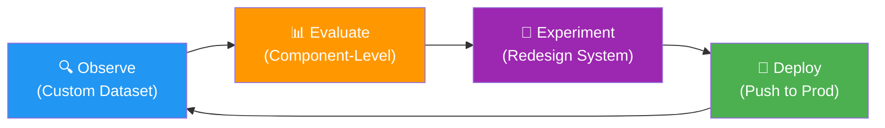
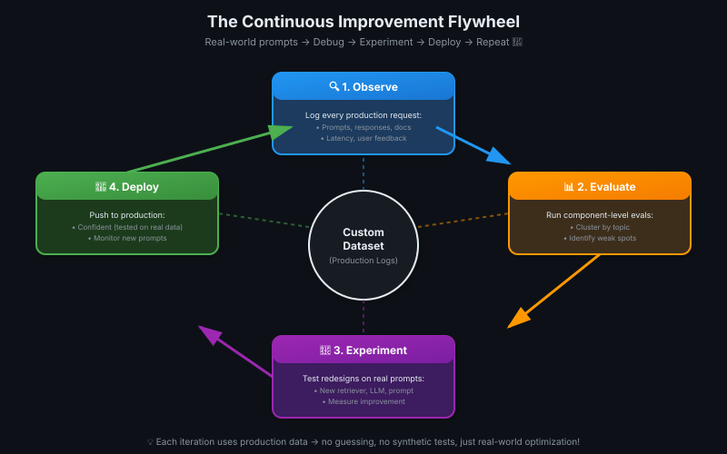
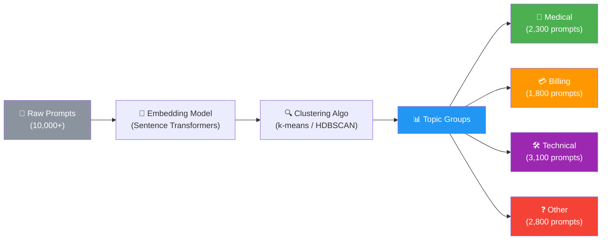

# 03 — Custom Evaluation Datasets

> Production prompts = real-world test data. Cluster topics → debug components → continuous improvement flywheel! 🔄✨

---

## The Problem: Generic Evals ≠ Your Real Users

**Most RAG systems are tested with:**
- Toy datasets from research papers
- Manually crafted synthetic prompts
- Assumptions about what users will ask

**But real production is messy:**
- Users ask questions you never imagined
- Edge cases appear at scale
- Performance varies dramatically by topic/domain
- You can't anticipate every failure mode ahead of time

> 💡 **Generic test dataset = exam prep for wrong paper.** Real users ka exam bahut alag hota hai! 📝

---

## What is a Custom Evaluation Dataset?

**Definition:** A collection of **actual prompts your system has received in production**, plus the journey data (what components were called, what was retrieved, how long it took, etc.).

### Core Structure

| Field | What It Captures | Example |
|-------|------------------|---------|
| **Prompt** | The user's input | "What are the side effects of ibuprofen?" |
| **Response** | The system's output | "Common side effects include..." |
| **Retrieved Docs** | What the retriever returned | `[doc_42, doc_91, doc_103]` |
| **Component Calls** | Internal routing/decisions | `{"router": "medical", "reranker": true}` |
| **Latency** | Time taken (total + per-component) | `{"total": 1.2s, "retriever": 0.3s, "llm": 0.8s}` |
| **User Feedback** | Thumbs up/down, explicit rating | `{"thumbs": "down", "comment": "wrong dosage"}` |
| **Metadata** | Session ID, timestamp, user segment | `{"session": "abc123", "topic": "pharma"}` |

**Key insight:** You're not creating new test data — you're **logging what already happened** so you can replay it and analyze it.

---

## Why Store This Data?

### 1️⃣ Understand Past Performance

**Without custom dataset:**
- "Users say it's slow" → but which component?
- "Some answers are wrong" → in what topics?
- "Low user satisfaction" → for what kinds of questions?

**With custom dataset:**
- Query: "Show me all prompts where retriever latency > 2 seconds"
- Query: "Which topics have < 50% thumbs up rate?"
- Query: "What documents are frequently retrieved but marked irrelevant?"

> 💡 **Custom dataset = production ka CCTV footage.** Crime scene investigation karna ho toh recording chahiye! 🎥

---

### 2️⃣ Run Experiments on Real-World Prompts

**The flywheel:**



**Example workflow:**
1. **Observe:** 30% of prompts in "medical" topic have low context relevance
2. **Evaluate:** Retriever is returning generic docs instead of specific drug info
3. **Experiment:** Test new embedding model + metadata filtering on logged prompts
4. **Deploy:** New system improves "medical" recall by 20% → push to production
5. **Observe:** Log new prompts, repeat cycle

**Critical:** You test changes on **actual user prompts**, not synthetic ones. This means experiments predict real-world impact.

---

## Real-World Example: Debugging Router Misclassification



### The Problem

**Symptom:** Users complaining that "technical support" questions get wrong answers.

**Investigation:**
1. Query custom dataset: filter prompts by `router_decision = "technical"`
2. Manual review: 40% of them should've been routed to "billing" instead
3. Root cause: Router's prompt classification is too coarse

### The Fix (Tested Before Deployment)

1. **Collect 200 logged prompts** marked as misrouted (from user feedback or manual review)
2. **Redesign router:** Add billing-specific keywords, retrain classifier
3. **Test redesigned router** on the same 200 prompts → accuracy jumps to 95%
4. **Deploy with confidence** — you've validated on real failures

**Without custom dataset:** You'd deploy blind, hope it works, and wait for complaints.

**With custom dataset:** You debug the exact failure cases, validate the fix, then deploy knowing it solves real problems.

---

## Visualizing Data: Clustering by Topic

When you have thousands of prompts, **topic clustering** helps you see patterns.

### How It Works



**Steps:**
1. **Embed all prompts** into vector space (same embedding model you use for retrieval)
2. **Run clustering algorithm** (e.g., k-means with k=10, or HDBSCAN for auto-discovery)
3. **Label clusters manually** (look at top prompts per cluster, name them)
4. **Analyze performance by cluster:**
   - Which topics have high latency?
   - Which have low user satisfaction?
   - Which generate the most retrieval failures?

> 💡 **Clustering = manual review ki organizing system.** 10,000 prompts ko ek-ek dekhna impossible. Clusters mein divide karo → patterns dikh jayenge! 📂

---

## Topic-Based Performance Analysis

Once clustered, you can **segment evaluation metrics by topic**.

### Example Dashboard

| Topic | Avg Latency | Thumbs Up % | Retrieval Recall | Top Issue |
|-------|-------------|-------------|------------------|-----------|
| **Medical** | 1.2s | 68% | 0.75 | Low context relevance |
| **Billing** | 0.9s | 82% | 0.88 | Fast but router misclassifies |
| **Technical** | 2.1s | 55% | 0.62 | Slow retriever + poor docs |
| **Other** | 1.5s | 70% | 0.70 | Mixed bag |

**What you learn:**
- **Medical:** Context quality is the bottleneck (not retriever speed)
- **Billing:** Router issue, not retrieval quality
- **Technical:** Need faster retriever AND better docs

**Action:** You now know exactly where to optimize, per topic. No guessing.

---

## The Flywheel of Continuous Improvement

Custom datasets enable a **virtuous cycle**:

### Phase 1: Observe
- Log every production prompt + response + journey data
- Store user feedback (thumbs up/down, comments)

### Phase 2: Evaluate
- Run component-level evals (retriever recall, context relevance, citation accuracy)
- Identify weak spots by topic/component

### Phase 3: Experiment
- Test redesigns (new retriever, different LLM, reranker, prompt changes) on logged prompts
- Measure improvement on real-world failures

### Phase 4: Deploy
- Push changes to production with confidence
- Monitor new prompts → back to Observe phase

**Key insight:** Each iteration uses **real user data** to guide decisions. You're not optimizing in a vacuum.

> 💡 **Flywheel = self-improving system.** Jitna zyada production data, utna better optimization. Compound growth! 🚀

---

## What Data to Store (Practical Checklist)

### ✅ Always Store
- **Prompt** (user input)
- **Response** (system output)
- **Retrieved document IDs** (what the retriever returned)
- **Timestamp** (when it happened)
- **Latency breakdown** (total + per-component)

### ✅ Highly Recommended
- **User feedback** (thumbs up/down, explicit ratings)
- **Router decision** (if using routing logic)
- **Reranker output** (if using reranker)
- **Embedding metadata** (which model version)

### 🤔 Optional (If Needed)
- **Full retrieved text** (expensive storage, but useful for deep debugging)
- **Session ID** (for multi-turn conversation analysis)
- **User segment** (enterprise vs free tier, geographic region)

### ❌ Don't Store (Privacy/Security)
- **Personally identifiable information (PII)** unless anonymized
- **Sensitive user data** (medical records, financial details) without consent

---

## Tools for Building Custom Datasets

### Phoenix by Arize (Open-Source)

**Features:**
- Logs traces (prompts, responses, component calls)
- Clusters prompts by topic automatically
- Visualizes performance by cluster
- Runs evals on logged data

**Example workflow:**
```python
import phoenix as px

# Log a production prompt
px.log_trace(
    prompt="What are the side effects of ibuprofen?",
    response="Common side effects include...",
    retrieved_docs=[doc_42, doc_91],
    latency={"retriever": 0.3, "llm": 0.8}
)

# Query logged data
df = px.query_traces(filter="latency.retriever > 2.0")

# Cluster prompts by topic
clusters = px.cluster_prompts(df, n_clusters=10)

# Evaluate by cluster
px.evaluate_by_cluster(clusters, metric="context_relevance")
```

**Why Phoenix?**
- **Free and open-source** (unlike many observability tools)
- **Built for RAG/LLM systems** (understands retriever, LLM, reranker components)
- **Auto-clustering** (doesn't require manual topic labeling)

---

## Key Takeaways

| # | Insight |
|---|---------|
| 1️⃣ | **Generic test datasets ≠ real users** — production prompts are messy, diverse, and unpredictable |
| 2️⃣ | **Custom dataset = production logs** — store prompts, responses, retrieved docs, latency, user feedback |
| 3️⃣ | **Two benefits:** (1) Understand past performance by topic/component, (2) Test redesigns on real-world prompts |
| 4️⃣ | **Clustering by topic** — embed + cluster prompts to see patterns across thousands of inputs |
| 5️⃣ | **Topic-based analysis** — segment metrics (latency, recall, satisfaction) by topic to find weak spots |
| 6️⃣ | **Flywheel:** Observe → Evaluate → Experiment → Deploy → repeat with new data |
| 7️⃣ | **Example:** Router misclassification debugged by filtering logged prompts, testing fix on real failures |
| 8️⃣ | **Always store:** prompt, response, retrieved doc IDs, timestamp, latency. Optional: full text, session ID |
| 9️⃣ | **Phoenix (Arize)** — open-source tool for logging, clustering, visualizing, evaluating RAG systems |

> 💡 **One-liner:** Custom datasets = aapke production ka black box recorder. Crash ho toh pata chal jayega kahan tha problem! 🛩️📦

---

## What's Next?

**Lesson 04:** Tracing — End-to-end visibility into every step of a RAG request (retriever → reranker → LLM → response)
