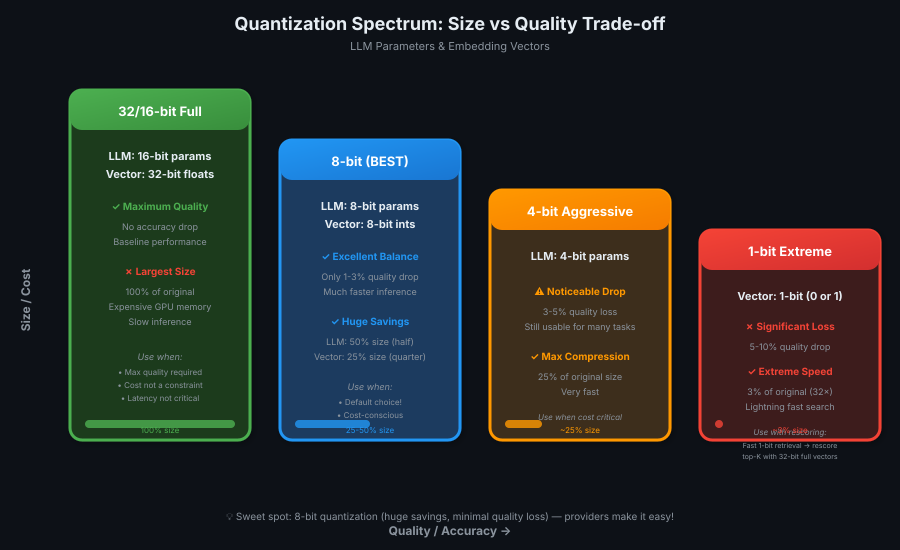
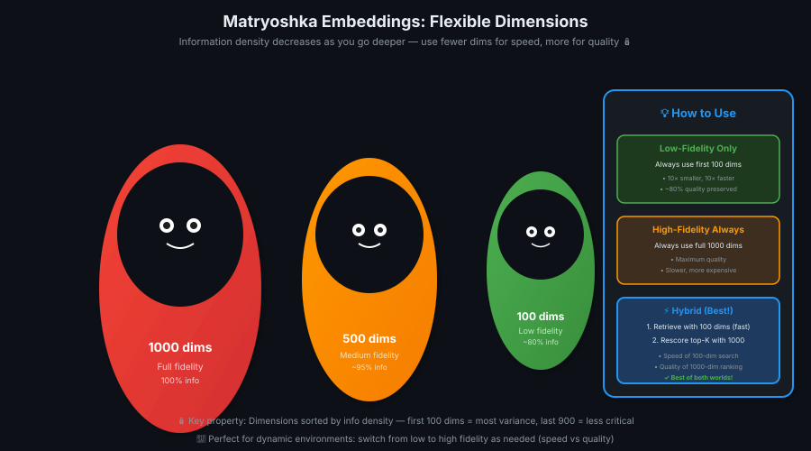

# 04 — Quantization

> Compress models & vectors without losing much quality — 4× smaller, faster, cheaper! 🗜️⚡

---

## What is Quantization?

**Definition:** Compression for LLMs and embedding vectors — replaces high-precision data (32-bit/16-bit) with lower-precision data (8-bit/4-bit/1-bit).

**Result:**
- **Smaller** models & vectors (less storage)
- **Cheaper** to run (less GPU memory)
- **Faster** inference (simpler calculations)
- **Trade-off:** Small drop in quality

> 💡 **Quantization = image compression.** Full resolution 24-bit image bahut bada hai. 12-bit ya 6-bit compress karo → size kam, quality thoda drop. Depends karta hai use case pe — worth it ya nahi! 🖼️

---

## The Image Compression Analogy

| Image Quality | Bits per Pixel | Size | Visual Quality |
|---------------|----------------|------|----------------|
| **High (original)** | 24 bits | 100% | Perfect, no artifacts |
| **Medium (compressed)** | 12 bits | 50% | Slightly worse, minor artifacts |
| **Low (compressed)** | 6 bits | 25% | Visible color artifacts |

**Key insight:** You can **cut the size in half** (12-bit) with minimal quality loss. Or cut to **one-quarter** (6-bit) with noticeable but acceptable quality drop for some use cases (thumbnails, previews).

**Same logic applies to LLMs and vectors.**

---

## Quantization for LLMs

### How It Works

**Standard LLM parameters:**
- Each parameter = **16 bits** (2 bytes)
- Modern models = **1 billion to 1 trillion parameters**
- Total size = **massive** (hundreds of GB)
- Requires **expensive GPUs** with high memory

**Quantized LLM parameters:**
- Compress 16-bit → **8-bit** (half the size)
- Or compress 16-bit → **4-bit** (one-quarter the size)
- **Result:** Same model, much smaller memory footprint

### Trade-offs



| Precision | Size vs Original | GPU Memory | Inference Speed | Quality Drop |
|-----------|------------------|------------|-----------------|--------------|
| **16-bit (original)** | 100% | High | Baseline | 0% |
| **8-bit** | 50% | Medium | Faster | 1-3% drop |
| **4-bit** | 25% | Low | Much faster | 3-5% drop |

**Key takeaway:** 8-bit quantization gives you **huge memory savings** (half the size) with only a **minor quality drop** (1-3% on benchmarks).

> 💡 **LLM quantization = same brain, smaller file.** 16-bit = HD video, 8-bit = compressed HD — thoda fuzzy but zarurat ke liye kaafi! 🎥

---

## Quantization for Embedding Vectors

### The Problem: Vectors Are Huge

**Standard 768-dimensional vector:**
- 768 dimensions × 32-bit float per dimension = **3 KB per vector**
- Knowledge base with **1 million vectors** = **3 GB** just for embeddings
- Higher-dimensional models (1536 dimensions) = **6 KB per vector** = **6 GB** for 1M vectors

**Stored in expensive RAM for fast search.**

### Integer Quantization (32-bit → 8-bit)

**Algorithm:**

1. **Find min/max** in each dimension across all vectors
2. **Divide range** into 256 sections (2^8 = 256 possible values with 8 bits)
3. **Assign each float** an integer (0-255) based on which section it falls into
4. **Store:** 8-bit integer + metadata (min value, section width)

**Result:** Approximate the original 32-bit float using only **8 bits** of data.

### Example Walkthrough

| Dimension | Original (32-bit float) | Min | Max | Range | Section Width | Quantized (8-bit int) |
|-----------|-------------------------|-----|-----|-------|---------------|-----------------------|
| **1** | 0.742 | 0.0 | 1.0 | 1.0 | 1.0/256 = 0.00391 | 189 |
| **2** | -0.312 | -1.0 | 1.0 | 2.0 | 2.0/256 = 0.00781 | 88 |
| **3** | 0.921 | 0.0 | 1.0 | 1.0 | 1.0/256 = 0.00391 | 235 |

**How to reverse (approximate):**
- Original ≈ min + (quantized_int × section_width)
- Example: 0.742 ≈ 0.0 + (189 × 0.00391) = 0.739

**Trade-off:**
- **Size:** 32 bits → 8 bits = **4× smaller**
- **Quality:** Recall@K drops by only **2-3 percentage points**

> 💡 **Integer quantization = drawer ka organizer.** 768 loose items (floats) ko 256 labeled boxes (0-255 integers) mein daal do. Thoda precision kam, but space bachta hai aur search fast! 📦

---

## 1-Bit (Binary) Quantization

### Extreme Compression

**How it works:**
- Each vector dimension = **1 bit** (0 or 1)
- 32 bits → 1 bit = **32× smaller**
- Value = **sign of original number** (positive = 1, negative = 0)

### Trade-offs

| Quantization Level | Size vs Original | Recall@K Drop | Use Case |
|--------------------|------------------|---------------|----------|
| **32-bit (original)** | 100% | 0% | Maximum quality |
| **8-bit integer** | 25% | 2-3% | Balanced (recommended) |
| **1-bit binary** | 3.125% | 5-10% | Extreme speed, rescoring |

**When to use 1-bit:**
- **Fast first-pass retrieval** (1-bit search)
- **Rescore with full 32-bit vectors** (only top-K candidates)
- **Hybrid approach:** Speed of 1-bit + quality of 32-bit

> 💡 **1-bit quantization = thumbnail browsing.** Pehle 1-bit thumbnails dekho (super fast), phir jo pasand aaye uska full image load karo (32-bit). Best of both worlds! 🖼️⚡

---

## Matryoshka Embedding Models

### The Nesting Doll Approach

**Problem:** Standard embeddings have fixed dimensions (768, 1536, etc.). You can't choose to use fewer dimensions without losing information randomly.

**Matryoshka models:** Embedding dimensions are **sorted by information density**.



### How It Works

```
Standard 1000-dim model:
[dim 1] [dim 2] [dim 3] ... [dim 999] [dim 1000]
↑ random info distribution across all dimensions

Matryoshka 1000-dim model:
[dim 1 (most info)] [dim 2] [dim 3] ... [dim 999 (least info)] [dim 1000]
↑ first 100 dims = 80% of info
↑ first 500 dims = 95% of info
↑ all 1000 dims = 100% of info
```

**Key property:** **Earlier dimensions have more variance** (more statistical information). Later dimensions have less variance (less critical).

### Use Cases

| Strategy | Dimensions Used | Benefit |
|----------|-----------------|---------|
| **Low-fidelity search** | First 100 dims | 10× smaller, 10× faster, 80% quality |
| **High-fidelity search** | All 1000 dims | Full quality, slower |
| **Hybrid approach** | 100 dims → retrieve top-K → rescore with 1000 dims | Fast retrieval + accurate ranking |

**Example workflow:**
1. **First pass:** Search using first 100 dims (fast, cheap, stored in RAM)
2. **Rescore:** Pull full 1000 dims from slower storage (only for top-K candidates)
3. **Result:** Speed of 100-dim search + quality of 1000-dim ranking

> 💡 **Matryoshka = adjustable spanner.** Zarurat ke hisaab se dimensions choose karo. Small task? 100 dims kaafi. Critical task? Full 1000 use karo. Flexibility! 🔧

---

## Practical Recommendations

### When to Use Quantization

| Component | Recommended Approach | Why |
|-----------|----------------------|-----|
| **LLM** | 8-bit quantization | 50% smaller, <2% quality drop, much faster |
| **Embedding vectors** | 8-bit integer quantization | 4× smaller, 2-3% Recall@K drop, faster search |
| **High-scale systems** | 1-bit + rescoring | 32× compression for first pass, full quality for top-K |
| **Dynamic environments** | Matryoshka models | Switch between low/high fidelity as needed |

### Provider Support

**Most LLM providers offer:**
- **Base model** (16-bit)
- **8-bit quantized model** (half size, minor quality drop)
- **4-bit quantized model** (quarter size, slightly larger quality drop)

**Most embedding model providers offer:**
- **32-bit embeddings** (standard)
- **8-bit quantized embeddings** (recommended default)
- Some also support **1-bit binary embeddings**

**Action:** Test both base and quantized models — measure quality drop vs cost/speed savings for YOUR use case.

---

## Key Takeaways

| # | Insight |
|---|---------|
| 1️⃣ | **Quantization = compression** — shrink LLMs & vectors by replacing high-precision data with low-precision |
| 2️⃣ | **8-bit LLMs:** Half the size, 1-3% quality drop, much faster inference |
| 3️⃣ | **8-bit vectors:** 4× smaller, 2-3% Recall@K drop, faster search |
| 4️⃣ | **Integer quantization algorithm:** Find min/max → divide into 256 sections → assign 0-255 integers |
| 5️⃣ | **1-bit (binary) quantization:** 32× compression, 5-10% quality drop, use for fast first-pass + rescore |
| 6️⃣ | **Matryoshka models:** Dimensions sorted by info density → use first N dims for speed, full dims for quality |
| 7️⃣ | **Hybrid strategies:** Fast retrieval (1-bit or Matryoshka 100-dim) + accurate rescoring (32-bit or 1000-dim) |
| 8️⃣ | **Recommendation:** Experiment with 8-bit quantization — huge cost/speed savings, minimal quality sacrifice |

> 💡 **One-liner:** Quantization = model ka diet plan! 16-bit ka weight kam karo → 8-bit fit model, same brain power, half the price! 💪⚡

---

## What's Next?

**Lesson 05:** Cost vs Response Quality — Balancing spend with output quality in production RAG systems
