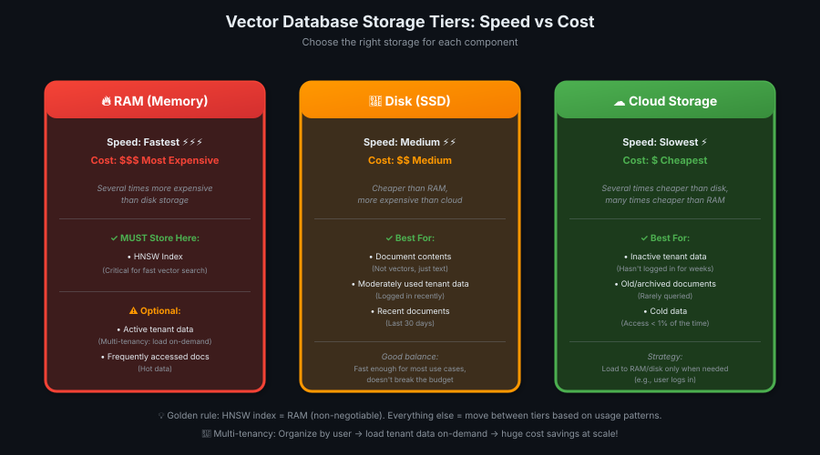
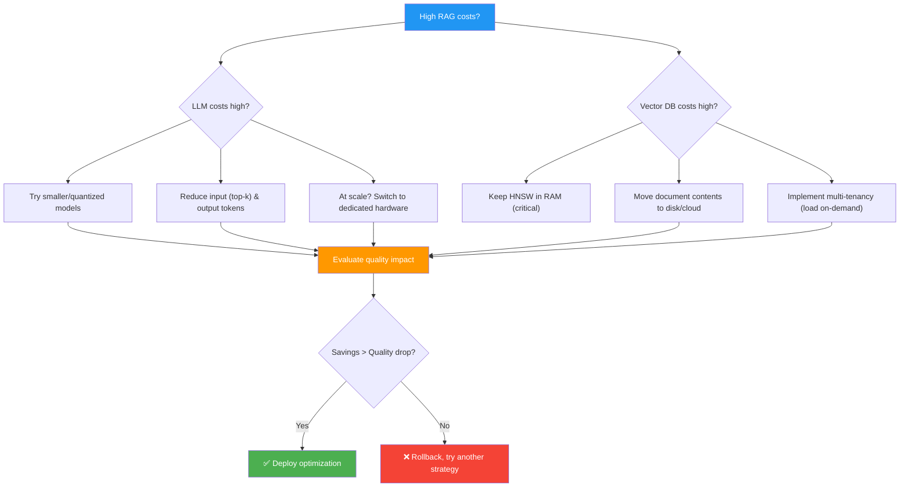

# 05 — Cost vs Response Quality

> Budget ka dhyaan rakho bina quality giraaye — smaller models, shorter prompts, smart storage! 💰⚖️

---

## The Cost Reality at Scale

**Early stage (prototype):**
- Focus: Get it working, explore what's possible
- Cost: Not the priority yet

**Production at scale (thousands/millions of requests):**
- Focus: Cost efficiency becomes critical
- Challenge: Reduce costs WITHOUT sacrificing quality

> 💡 **Prototype = lab experiment. Production = factory line.** Lab mein budget matter nahi karta. Factory mein har paisa count hota hai! 🏭💸

---

## The Two Biggest Costs in RAG Systems

| Component | Why It's Expensive | Optimization Strategy |
|-----------|-------------------|----------------------|
| **LLM** | Pay per token (input + output) | Smaller models, shorter prompts, quantization, dedicated hardware |
| **Vector Database** | RAM is expensive (fast storage) | Move data between RAM/disk/cloud storage, multi-tenancy |

**Key principle:** Understand the source of costs → ensure they're justified by performance.

---

## LLM Cost Optimization

### Strategy 1: Use Smaller Models

**Why it works:**
- Smaller models = **fewer parameters** = cheaper per token
- Or: **Quantized models** (8-bit/4-bit) = faster + cheaper
- Many tasks **don't need** the most powerful model

**Where to apply:**

| Use Case | Model Size | Reasoning |
|----------|------------|-----------|
| **Core response generation** | Large (e.g., GPT-4, Claude) | Needs high quality, user-facing |
| **Router LLM (agentic)** | Small (e.g., GPT-3.5-turbo) | Simple classification task |
| **Evaluator LLM (agentic)** | Small/Medium | Yes/no or rating, not complex generation |
| **Citation extractor** | Small | Structured output, limited task |

**Trade-off:** Test smaller models on YOUR use case — you might be surprised how well they perform, especially if fine-tuned.

> 💡 **Smaller model = lightweight tool.** Nail thokne ke liye hammer chahiye, sledgehammer nahi! Overkill mat karo 🔨

---

### Strategy 2: Limit Input & Output Tokens

**Input tokens (retrieval context):**
- RAG prompts can be **huge** (many retrieved chunks × 500 tokens each)
- **Solution:** Reduce top-k (retrieve fewer documents)
- Example: top-k=10 → top-k=5 = half the input tokens

**Output tokens (LLM response):**
- LLMs can be **long-winded** (you pay for every word!)
- **Solution:** Update system prompt to encourage **succinct responses**
- Or: Set a **firm token limit** (e.g., "Max 100 tokens")

**Example system prompt change:**
```
Before: "Provide a detailed answer with examples."
After: "Provide a concise answer in 2-3 sentences. Be direct."
```

**Trade-off:** Shorter responses might feel abrupt — test user satisfaction.

> 💡 **Token limit = word budget.** LLM ko bolo: "Jitna kam shabdo mein samjha sako, utna acha!" 📝✂️

---

### Strategy 3: Dedicated Hardware (At Scale)

**Cloud LLM providers (standard):**
- **Pay-per-token** pricing
- Examples: OpenAI API, Anthropic API, Together AI inference endpoints
- **Best for:** Prototyping, low-volume production

**Dedicated hardware (at scale):**
- **Pay-per-hour** for rented GPUs (AWS, Google Cloud, Together AI)
- Your model runs **exclusively** on that hardware
- **Best for:** Thousands/millions of requests

**Cost comparison example:**

| Pricing Model | 1 million requests | Cost |
|---------------|-------------------|------|
| **Pay-per-token** | 1M × avg 1000 tokens × $0.002/1k tokens | **$2,000** |
| **Dedicated GPU** | 24 hours/day × $2/hour × 30 days | **$1,440** (28% savings) |

**Additional benefit:** **Better reliability** — no shared traffic, no throttling, predictable latency.

**When to switch:** When pay-per-token cost > dedicated hardware cost (usually at high scale).

> 💡 **Dedicated hardware = apna factory.** Shared API = rented machinery (pay per use). Scale pe apna setup sasta! 🏗️

---

## Vector Database Cost Optimization

### The Three Storage Tiers



| Storage Type | Speed | Cost (per GB) | Use Case |
|--------------|-------|---------------|----------|
| **RAM** | Fastest | 💰💰💰 Most expensive | HNSW index (critical for fast search) |
| **Disk (SSD)** | Medium | 💰💰 Medium | Frequently accessed documents |
| **Cloud Object Storage** | Slowest | 💰 Cheapest | Rarely accessed documents, archival |

**Key insight:** RAM is **several times more expensive** than disk, which is **several times more expensive** than cloud storage.

**Optimization goal:** Only pay for fast storage (RAM) when it actually benefits performance.

---

### What Should Go Where?

**Must be in RAM:**
- **HNSW index** — critical for fast vector search
- Without HNSW in RAM, search becomes **orders of magnitude slower**

**Can be in disk memory:**
- **Frequently accessed document contents** (not the vectors themselves, the text)
- Example: Recent documents, popular articles

**Can be in cloud object storage:**
- **Rarely accessed documents** (old data, infrequent queries)
- Load into RAM only when needed

> 💡 **Storage tiers = kitchen organization.** Daily use items (masale) = countertop (RAM). Weekly use (daale) = cabinet (disk). Rarely used (party dishes) = storage room (cloud)! 🍴📦

---

### Multi-Tenancy: Smart Storage by User

**Problem:** 1 million documents owned by 1,000 different users. Each user only accesses their own documents.

**Without multi-tenancy:**
- All 1M documents in RAM → expensive
- User A searches → loads their 1,000 docs + everyone else's 999,000 (waste!)

**With multi-tenancy:**
- **Organize documents by tenant** (user/organization)
- Each tenant has **their own HNSW index**
- Load tenant's data into RAM **only when they log in**
- Move tenant's data to slower storage when inactive

**Example strategies:**

| Strategy | When to Load into RAM | When to Move to Disk/Cloud |
|----------|----------------------|----------------------------|
| **On-demand** | User logs in | User logs out or inactive for 1 hour |
| **Geographic** | Daytime in user's region | Nighttime in user's region |
| **Tiered** | Premium users always in RAM | Free-tier users on-demand |

**Cost savings:** You're not paying for 1M documents in RAM 24/7. You're paying for ~10k active users' documents at any given time.

> 💡 **Multi-tenancy = hotel rooms.** Har guest ka apna room (HNSW index). Check-in = load to RAM. Check-out = move to storage. Empty rooms ka RAM waste nahi hota! 🏨

---

## Cost Optimization Decision Tree



---

## Key Takeaways

| # | Insight |
|---|---------|
| 1️⃣ | **Two biggest costs:** LLMs (per token) + Vector databases (RAM storage) |
| 2️⃣ | **LLM optimization:** Smaller models, fewer tokens, quantization, dedicated hardware at scale |
| 3️⃣ | **Smaller models work!** Especially for limited tasks (router, evaluator, citation) — test before assuming you need the biggest model |
| 4️⃣ | **Reduce tokens:** Lower top-k (fewer docs) + encourage succinct responses (system prompt + token limits) |
| 5️⃣ | **Dedicated hardware:** Pay-per-hour > pay-per-token at high scale (thousands/millions of requests) |
| 6️⃣ | **Vector DB tiers:** RAM (fastest, expensive) → Disk (medium) → Cloud storage (slow, cheap) |
| 7️⃣ | **HNSW index MUST be in RAM** — critical for fast vector search, everything else is negotiable |
| 8️⃣ | **Multi-tenancy:** Organize by user/org → load tenant data into RAM only when active → massive savings |
| 9️⃣ | **Always evaluate trade-offs:** Use observability to measure quality drop vs cost savings → deploy if worth it |

> 💡 **One-liner:** Cost optimization = smart resource allocation. Big model + full RAM jahan zaruri hai wahan use karo, baaki jagah chhote tools se kaam chalao! 🎯💰

---

## What's Next?

**Lesson 06:** Latency vs Response Quality — Speed vs accuracy trade-offs (how to make your RAG system faster without hurting quality)
