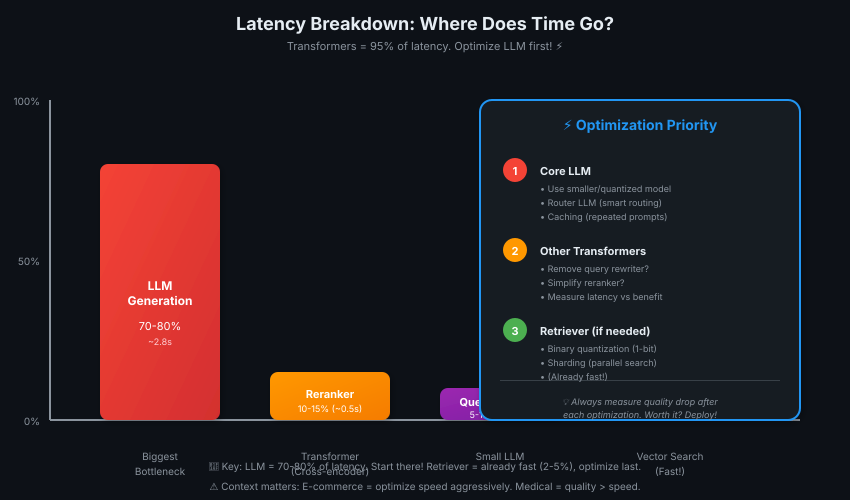
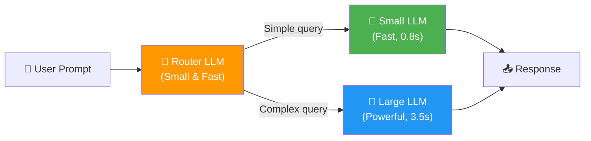
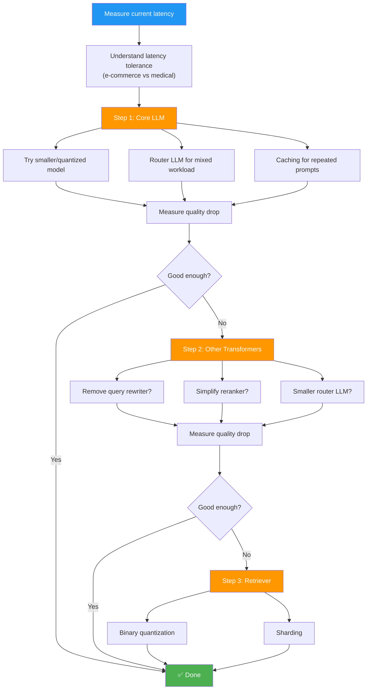

# 06 — Latency vs Response Quality

> Speed ya quality? Dono chahiye! Context matters — e-commerce fast, medical slow 🏃‍♂️⚖️

---

## The Latency-Quality Trade-Off

**The problem:**
- Adding a retriever → adds latency
- Adding reranker, agentic workflows → increases latency further
- But: higher quality responses

**The challenge:** Find the right balance for YOUR use case.

> 💡 **Context is king!** E-commerce customer = 2 seconds max patience. Doctor diagnosing rare disease = 30 seconds theek hai, quality zyada important! ⏱️🩺

---

## How Much Latency Can Your System Tolerate?

### Use Case Examples

| Use Case | Latency Tolerance | Priority | Why |
|----------|------------------|----------|-----|
| **E-commerce recommendations** | <500ms | Speed > Quality | Users have zero patience, imperfect recommendation OK |
| **Customer support chatbot** | 1-2 seconds | Balanced | Fast enough to feel responsive, quality matters |
| **Medical diagnosis assistant** | 10-30 seconds | Quality > Speed | Accuracy critical, doctors will wait for correct answer |
| **Legal document search** | 5-10 seconds | Quality > Speed | Missing relevant case = costly mistake |
| **Real-time code autocomplete** | <100ms | Speed > Quality | Typing flow breaks if slow, can regenerate |

**Key principle:** Understand YOUR user's patience threshold BEFORE optimizing.

> 💡 **E-commerce = race car, medical = research lab.** Race mein 0.5 second ki jeet hoti hai. Lab mein accuracy matter karti hai, time nahi! 🏎️🔬

---

## Where Does Latency Come From?

### The Golden Rule

**Almost all latency = running a transformer.**

**Component latency breakdown (typical RAG system):**

| Component | Latency Contribution | Why |
|-----------|---------------------|-----|
| **LLM (generation)** | 70-80% | Transformer-based, auto-regressive generation (token-by-token) |
| **Reranker (cross-encoder)** | 10-15% | Transformer-based, scores every doc pair |
| **Query rewriter** | 5-10% | Transformer-based LLM call |
| **Router LLM** | 3-5% | Small transformer, but still a call |
| **Retriever (vector search)** | 2-5% | Fast! Modern vector databases are highly optimized |
| **Embedding** | 1-3% | Transformer, but smaller than LLM |

**Key insight:** Vector databases are **fast and scale well**. If you want to cut latency, start with LLMs.

> 💡 **Transformer = traffic light.** Har transformer pe ruko. LLM = sabse lamba red light! Vector search = green signal, turant nikal jao 🚦⚡

---

## Strategy 1: Optimize Core LLM

### Approach 1: Use Smaller Models

**Why it works:**
- Smaller models = fewer parameters = faster inference on same hardware
- Or: Quantized models (8-bit/4-bit) = faster

**Trade-off:** Slightly lower quality, but often acceptable.

**Example:**

| Model | Latency | Quality Score | Use Case |
|-------|---------|---------------|----------|
| **GPT-4 (large)** | 3.5s | 95% | Complex reasoning, user-facing |
| **GPT-3.5-turbo (medium)** | 1.2s | 85% | General Q&A, balanced |
| **GPT-3.5-turbo-8bit (quantized)** | 0.8s | 83% | High-volume, cost-sensitive |

**Action:** Test if a smaller model gives "good enough" quality for YOUR task.

---

### Approach 2: Router LLM (Smart Model Selection)

**How it works:**
1. **Fast router LLM** looks at the prompt
2. **Routes to:**
   - **Small, fast model** for simple queries
   - **Large, powerful model** for complex queries

**Example workflow:**

**Benefit:** Average latency drops (most queries are simple), quality maintained for hard queries.

**Example split:**
- 70% of queries → small model (avg 0.8s)
- 30% of queries → large model (avg 3.5s)
- **Average latency:** 0.7 × 0.8 + 0.3 × 3.5 = 1.6s (vs 3.5s for always-large)

> 💡 **Router = restaurant host.** Simple order (chai) = counter pe bhej do (fast). Complex order (5-course meal) = chef ke paas bhejo (slow but quality)! 🍵🍽️

---

### Approach 3: Caching (For Repeated Prompts)

**When to use:** Systems that receive **very similar prompts** frequently.

**How it works:**

1. **Maintain a cache** of frequent prompts + responses
2. **New prompt arrives** → compute similarity to cached prompts
3. **If close match found** → return cached response immediately (skip LLM generation)
4. **If no match** → generate normally, add to cache

**Advanced version (personalized caching):**
- **Retrieve cached response** (if similar prompt exists)
- **Pass cached response + user prompt** to **small, fast LLM**
- **LLM makes small adjustments** to personalize the response

**Trade-off:** Works best for FAQ-style systems, less useful for unique queries.

**Example:**

| Strategy | Latency | Quality | Use Case |
|----------|---------|---------|----------|
| **No caching** | 3.5s | 100% | Every query unique |
| **Exact cache hit** | 0.05s | 100% | Identical prompt seen before |
| **Similar prompt + small LLM tweak** | 0.5s | 95% | Similar prompt, personalize slightly |

> 💡 **Cache = restaurant ka menu.** Baar baar wahi order? Menu pe likha hai, turant serve! Naya order? Chef ko banana padega 📋👨‍🍳

---

## Strategy 2: Optimize Other Transformer Components

**Once core LLM is optimized, move to other components.**

### Components to Review

| Component | Purpose | Latency | Action |
|-----------|---------|---------|--------|
| **Query rewriter** | Improve query before retrieval | 0.5-1s | Measure benefit vs latency — remove if marginal |
| **Reranker (cross-encoder)** | Score retrieved docs for relevance | 0.8-1.5s | Test if bi-encoder retrieval alone is "good enough" |
| **Router LLM (agentic)** | Decide which tool/path to take | 0.3-0.5s | Use smallest model possible, or rule-based routing |
| **Citation extractor** | Extract sources from LLM response | 0.2-0.4s | Could this be done post-processing instead? |

**Key approach:**
1. **Measure latency** each component adds
2. **Measure quality improvement** each component provides
3. **Remove if:** Latency cost > quality benefit

**Example decision:**
- **Query rewriter** adds 0.8s
- **Quality improvement:** +2% retrieval recall
- **Decision:** For e-commerce (speed critical) → remove. For medical (quality critical) → keep.

> 💡 **Components = suitcase packing.** Har cheez zaroori nahi! Jo weight zyada add kare aur fayda kam, woh ghar pe chhod do 🎒✂️

---

## Strategy 3: Optimize Retriever

**Retrieval is already fast, but you can make it faster.**

### Technique 1: Binary Quantization (1-bit Vectors)

**How it works:**
- Compress vectors from 32-bit → **1-bit** (32× smaller)
- Each dimension = 0 or 1 (sign of original number)
- **Simpler distance calculations** = faster search

**Trade-off:** 5-10% recall drop, but 5-10× faster search.

**Use case:** First-pass retrieval → rescore top-K with full vectors.

---

### Technique 2: Sharding (For Large Databases)

**How it works:**
- Split large vector database into **multiple instances** (shards)
- Each shard = subset of documents
- **Search in parallel** across shards

**Benefit:** Latency decreases as database size grows (distributed search).

**Example:**
- 10M documents in 1 instance = 500ms search
- 10M documents in 10 shards (1M each) = 50ms per shard (parallel) = 50ms total

**Note:** Most vector database providers (Pinecone, Weaviate, Qdrant) include sharding tools.

> 💡 **Sharding = restaurant mein multiple counters.** Ek line lambi = slow. 10 counters = sab parallel, fast! 🏪⚡

---

## Optimization Priority (Start Here)

### The Iterative Approach

**Key principle:** Start where the biggest latency bottleneck is (usually core LLM), measure impact, iterate.

---

## Key Takeaways

| # | Insight |
|---|---------|
| 1️⃣ | **Context matters:** E-commerce needs <500ms (speed > quality), medical can tolerate 10-30s (quality > speed) |
| 2️⃣ | **Transformers = 95% of latency** — LLM generation is the biggest bottleneck (70-80%) |
| 3️⃣ | **Vector databases are fast** — modern vector search is highly optimized, not the bottleneck |
| 4️⃣ | **Optimization priority:** Core LLM → Other transformers → Retriever |
| 5️⃣ | **Core LLM optimization:** Smaller models, router LLM (smart routing), caching (repeated prompts) |
| 6️⃣ | **Router LLM = best of both worlds** — route simple queries to fast models, complex queries to powerful models |
| 7️⃣ | **Caching works for FAQ-style systems** — similarity search → return cached response instantly (or personalize with small LLM) |
| 8️⃣ | **Other components to review:** Query rewriter, reranker, router — measure latency vs quality, remove if cost > benefit |
| 9️⃣ | **Retriever optimization:** Binary quantization (1-bit vectors) + sharding (parallel search across instances) |
| 🔟 | **Iterative approach:** Measure → optimize biggest bottleneck → measure quality drop → acceptable? → deploy, else rollback |

> 💡 **One-liner:** Latency optimization = traffic management. Biggest jam (LLM) solve karo pehle, phir chhoti bottlenecks dekho. Observability = CCTV, har step ka time measure karo! 🚦📊

---

## What's Next?

**Lesson 07:** Security in RAG Systems — Prompt injection, data leaks, privacy considerations (protecting user data while maintaining functionality)
