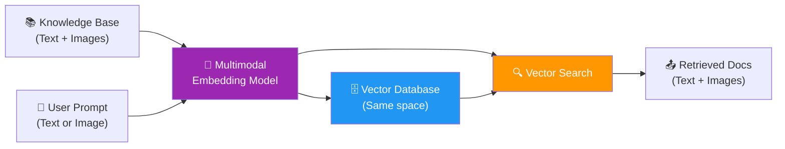
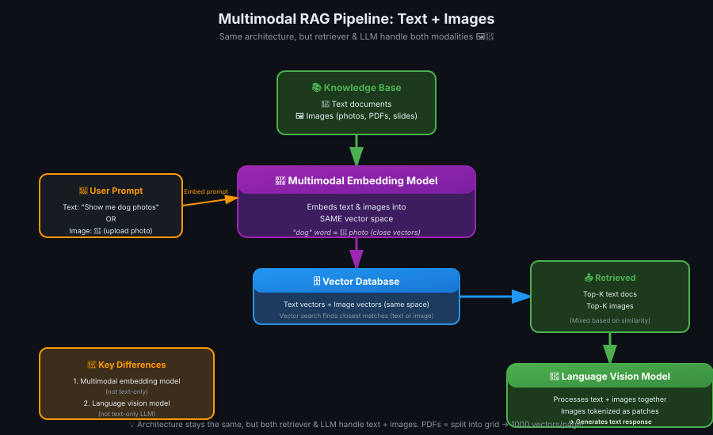

# 08 — Multimodal RAG

> Text se aage badho — images, PDFs, slides bhi knowledge base mein! 🖼️📄✨

---

## Why Multimodal RAG Matters

**The problem with text-only RAG:**
- Information stored in **many formats:** Slide decks, PDFs, images, videos, audio
- Text-only systems **can't access** valuable info in images/charts
- **Blind to visual content** = incomplete knowledge base

**The solution: Multimodal RAG**
- Handle **text + images** (most common)
- Also possible: audio, video
- Makes **full content** available to LLM

> 💡 **Text-only RAG = andha system.** Slide dekh nahi sakta, chart samajh nahi sakta. Multimodal RAG = aankhein mil gayi! 👁️📊

---

## What is a Multimodal Model?

**Definition:** A model designed to handle **multiple data types** (text, images, audio, video).

**Typical multimodal RAG system:**

| Component | Input | Output |
|-----------|-------|--------|
| **Prompt** | Text OR Image | — |
| **Knowledge Base** | Text + Image files | — |
| **Response** | — | Text (generated) |

**Two components need multimodal capabilities:**
1. **Embedding model** (retriever)
2. **Language vision model** (LLM)

---

## Component 1: Multimodal Embedding Models

### How They Work

**Multimodal embedding model:** Embeds **multiple formats** into the **same vector space**.

**Example:**

| Input | Vector Space Location |
|-------|----------------------|
| Word: "dog" | Region A (close to "puppy", "canine") |
| Word: "puppy" | Region A (close to "dog") |
| **Image:** 🐶 (dog photo) | **Region A (close to "dog", "puppy")** |
| Word: "tree" | Region B (close to "plant", "forest") |
| **Image:** 🌳 (tree photo) | **Region B (close to "tree")** |

**Key insight:** Images and text with **similar meanings** are embedded **close together** in the same vector space.

> 💡 **Multimodal embedding = bilingual dictionary.** "Dog" word aur dog ki photo — dono ka matlab same hai, toh dono paas paas! 🐶📖

---

### Retrieval with Multimodal Embeddings

**Workflow:**



**Steps:**
1. **Embed knowledge base:** Text + images → vectors (same space)
2. **User submits prompt:** Text OR image
3. **Embed prompt:** Using same multimodal model
4. **Vector search:** Find closest vectors (whether text or image)
5. **Return results:** Retrieved text + images → augmented prompt

**Just like text-only RAG, but works with images too!**

---

## Component 2: Language Vision Models (LVMs)

### What They Are

**Language vision model:** LLM that can process **both text AND images**.

**How it works:**
- **Tokenize text:** Normal tokenization (words → tokens)
- **Tokenize images:** Break image into **patches** → each patch = token

**Image tokenization:**

```
Original Image (e.g., 224×224 pixels)
        ↓
Break into 16×16 pixel patches
        ↓
Each patch = 1 token
        ↓
Total tokens: ~100 (low-res) to ~1000 (high-res)
```

**Key point:** Both text and images are converted to **token sequences** → LLM processes them the same way.

> 💡 **Image tokenization = photo ko puzzle pieces mein tod do.** Har piece ek token. LLM ko pieces dikhao, woh puri picture samajh lega! 🧩🖼️

---

### How Language Vision Models Work

**Process:**

| Step | What Happens |
|------|-------------|
| 1️⃣ | **Tokenize:** Text + images → token sequence |
| 2️⃣ | **Transformer:** Processes multimodal tokens together |
| 3️⃣ | **Understanding:** Develops nuanced understanding of text-image relationships |
| 4️⃣ | **Generate:** Produces **text tokens** as output (responds to prompt) |

**Just like standard LLMs, but input includes image patches as tokens.**

**Examples of LVMs:**
- GPT-4 Vision (OpenAI)
- Claude 3 (Anthropic)
- Gemini (Google)
- LLaVA (open-source)

---

## Multimodal RAG Architecture

### High-Level Flow



**Components:**

| Component | Text-Only RAG | Multimodal RAG |
|-----------|---------------|----------------|
| **Embedding Model** | Text embeddings | **Multimodal embeddings** (text + images) |
| **Knowledge Base** | Text docs only | **Text + images** |
| **Vector Database** | Text vectors | **Text + image vectors** (same space) |
| **LLM** | Text-only LLM | **Language vision model** (processes images) |
| **Response** | Text | Text |

**Key difference:** Multimodal embedding + LVM enable handling images throughout the pipeline.

---

## Handling PDFs and Slides

### The Problem

**PDFs/slides are information-dense:**
- Single page contains: text, charts, captions, images
- **One vector per page?** → Struggles to capture all nuance
- **Need chunking for images** (just like text)

> 💡 **PDF page = encyclopedia page.** Ek vector se puri page ka meaning nahi capture ho sakta. Chunking zaroori! 📚✂️

---

### Traditional Approach (Error-Prone)

**Sophisticated detection algorithms:**
1. Identify regions: chart, image, text, table
2. Extract each region separately
3. Embed each region as separate chunk

**Problems:**
- **Error-prone:** Misidentifies regions (chart vs image, text vs caption)
- **Finicky:** Requires tuning for different PDF formats
- **Complex:** Hard to implement reliably

---

### Modern Approach: PDF RAG (Grid-Based)

**How it works:**

```
PDF Page
    ↓
Split into N×N grid (e.g., 32×32 squares)
    ↓
Each square = separate chunk
    ↓
Embed each square with multimodal model
    ↓
1 page = ~1000 vectors (instead of 1)
```

**Key insight:** Don't worry about "sensible" boundaries — just split into uniform grid.

**Retrieval (like ColBERT MaxSim):**
1. User submits query: "What's the revenue chart?"
2. Each **word in query** finds its **best matching square** on each page
3. **Sum scores** across all words → page-level score
4. Return top-K pages

**Example:**

| Query Word | Best Square on Page 1 | Score |
|------------|----------------------|-------|
| "revenue" | Square 42 (chart label) | 0.9 |
| "chart" | Square 43 (bar chart) | 0.85 |
| **Total** | — | **1.75** |

> 💡 **PDF RAG = pizza ko squares mein kaat do.** Har square alag se embed karo. Query ko best matching squares dhundo! 🍕📊

---

## PDF RAG: Trade-offs

### ✅ Advantages

| Benefit | Why It Matters |
|---------|----------------|
| **Flexible** | Works with any image (slides, PDFs, photos) |
| **No region detection** | No error-prone boundary algorithms |
| **Good retrieval performance** | ColBERT-style MaxSim = accurate |
| **Handles dense content** | Each square captures local context |

---

### ❌ Disadvantages

| Drawback | Impact |
|----------|--------|
| **Massive vector storage** | 1 page = 1000 vectors (vs 1 vector with traditional) |
| **Higher cost** | More vectors = more RAM = more expensive |
| **Slower indexing** | Must embed 1000× more vectors |

**Example:**
- **Traditional:** 100-page PDF = 100 vectors
- **PDF RAG:** 100-page PDF = 100,000 vectors (1000× more)

**Mitigation:**
- Vector databases increasingly support efficient storage (quantization, compression)
- Hardware is getting cheaper
- Trade-off often worth it for quality

---

## Multimodal RAG in Practice

### When to Use Multimodal RAG

| Use Case | Why Multimodal? |
|----------|-----------------|
| **Technical documentation** | Diagrams, architecture charts, code screenshots |
| **Medical records** | X-rays, MRI scans, patient photos |
| **E-commerce** | Product images, comparison charts |
| **Research papers** | Figures, graphs, equations (as images) |
| **Slide decks** | Presentations with charts/images |
| **Legal documents** | Scanned contracts, signatures, diagrams |

**Key principle:** If your knowledge base has **visual information**, multimodal RAG unlocks it.

---

### Current State (2026)

**Maturity:**

| Component | Status |
|-----------|--------|
| **Language vision models** | ✅ Widely available (GPT-4V, Claude 3, Gemini) |
| **Multimodal embeddings** | 🟡 Experimental but improving (CLIP, ImageBind, BridgeTower) |
| **Vector databases** | 🟡 Adding multimodal support (Weaviate, Pinecone, Qdrant) |
| **PDF RAG** | 🟢 Promising direction, active research |

**Expect:** Rapid progress, easier to implement over time.

---

## Key Takeaways

| # | Insight |
|---|---------|
| 1️⃣ | **Multimodal RAG = text + images** in same pipeline (also audio/video possible) |
| 2️⃣ | **Two key components:** Multimodal embedding model + language vision model (LVM) |
| 3️⃣ | **Multimodal embeddings:** Text + images embedded in same vector space — similar meanings = close vectors |
| 4️⃣ | **Language vision models:** Tokenize images as patches (~100-1000 tokens), process with transformer like text |
| 5️⃣ | **Retrieval works the same:** Embed prompt (text/image) → vector search → retrieve text + images |
| 6️⃣ | **PDF/slide challenge:** Information-dense pages need chunking (not 1 vector per page) |
| 7️⃣ | **PDF RAG (modern):** Split page into N×N grid → embed each square → retrieval like ColBERT MaxSim |
| 8️⃣ | **PDF RAG trade-off:** Flexible + accurate BUT massive vector storage (1 page = 1000 vectors) |
| 9️⃣ | **Status:** LVMs widely available, multimodal embeddings experimental, vector DBs adding support |
| 🔟 | **Future:** Expect rapid progress, easier to build multimodal RAG systems |

> 💡 **One-liner:** Multimodal RAG = aankhein + dimag dono! Text padh sakta hai, images samajh sakta hai. PDFs ko grid mein tod do → har square embed karo! 🖼️🧠

---

## What's Next?

**Lesson 09:** Lab — Improving the Chatbot (hands-on optimization of RAG system using production techniques)

**Congratulations!** 🎉 You've completed the RAG course — from fundamentals to production-ready multimodal systems!
