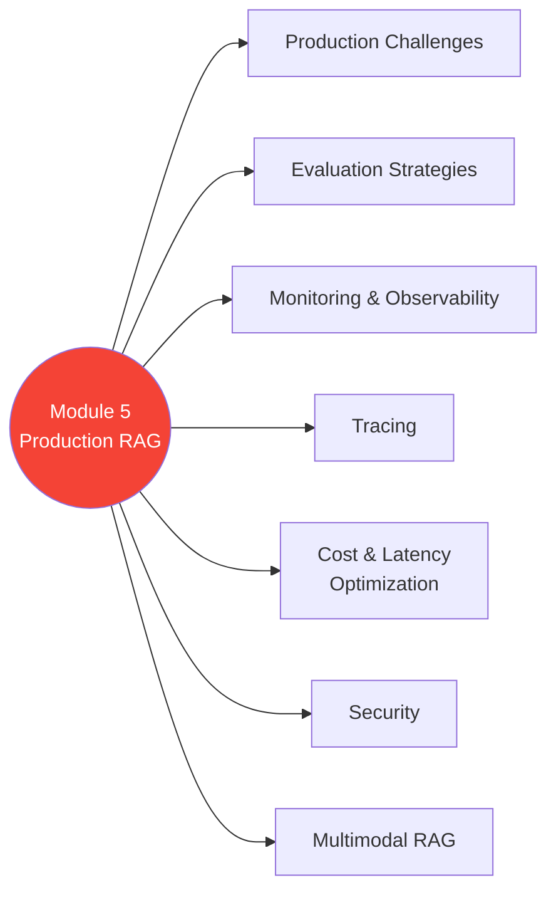

# 🚀 Module 5 — RAG Systems in Production

> Lab se production tak — evaluation, monitoring, security, optimization sab yahan! 🏭

---

## 🧠 Brain — Module Overview

## 📊 Progress

| # | Lesson | Confidence | Revised |
|---|--------|-----------|---------|
| 01 | [Module 5 Introduction](01-module-introduction.md) | 🔴 | — |
| 02 | [What Makes Production Challenging](02-production-challenges.md) | 🔴 | — |
| 03 | [RAG Evaluation Strategies](03-rag-evaluation-strategies.md) | 🔴 | — |
| 04 | [Logging, Monitoring & Observability](04-logging-monitoring-observability.md) | 🔴 | — |
| 05 | [Tracing a RAG System](05-tracing-rag-system.md) | 🔴 | — |
| 06 | [Customized Evaluation](06-customized-evaluation.md) | 🔴 | — |
| 07 | [Quantization](07-quantization.md) | 🔴 | — |
| 08 | [Cost vs Response Quality](08-cost-vs-quality.md) | 🔴 | — |
| 09 | [Latency vs Response Quality](09-latency-vs-quality.md) | 🔴 | — |
| 10 | [Security](10-security.md) | 🔴 | — |
| 11 | [Multimodal RAG](11-multimodal-rag.md) | 🔴 | — |
| 12 | [Lab: Improving the Chatbot](12-lab-improving-chatbot.md) | 🔴 | — |

**Overall confidence:** 🔴 Not started

## 🧩 Memory Fragments
> - _Add fragments as you learn..._

---

## 🎬 Teach Mode

| # | Lesson | What You'll Get |
|---|--------|-----------------|
| 01 | Module 5 Introduction | Module roadmap |
| 02 | Production Challenges | Why production RAG is hard |
| 03 | Evaluation Strategies | Measuring RAG system quality |
| 04 | Logging & Monitoring | Observability in production |
| 05 | Tracing | End-to-end request tracing |
| 06 | Customized Evaluation | Building custom eval pipelines |
| 07 | Quantization | Model compression for efficiency |
| 08 | Cost vs Quality | Balancing spend with output quality |
| 09 | Latency vs Quality | Speed vs accuracy tradeoffs |
| 10 | Security | Prompt injection, data leaks, safety |
| 11 | Multimodal RAG | Images, audio, video in RAG |
| 12 | Lab: Improving Chatbot | Optimizing the RAG chatbot |

**Supporting:** [Flashcards](flashcards.md)

---

## 📚 Source
> 🎓 [RAG Course — Module 5](https://learn.deeplearning.ai/courses/retrieval-augmented-generation) — DeepLearning.AI

## 🔗 Connected Topics
> ← [Module 4: LLMs & Text Generation](../module-4-llms-text-generation/) · [System Design](../../system-design/)
