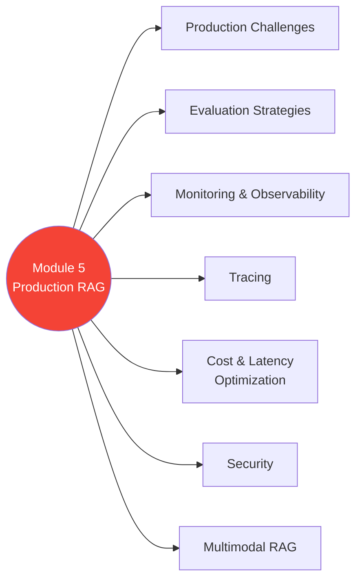

# 🚀 Module 5 — RAG Systems in Production

> Lab se production tak — evaluation, monitoring, security, optimization sab yahan! 🏭

---

## 🧠 Brain — Module Overview

```mermaid
graph LR
    M5(("Module 5<br/>Production RAG"))
    M5 --> CHAL["Production Challenges"]
    M5 --> EVAL["Evaluation Strategies"]
    M5 --> MON["Monitoring & Observability"]
    M5 --> TRACE["Tracing"]
    M5 --> OPT["Cost & Latency<br/>Optimization"]
    M5 --> SEC["Security"]
    M5 --> MM["Multimodal RAG"]

    style M5 fill:#f44336,color:#fff
```

## 📊 Progress

| # | Lesson | Confidence | Revised |
|---|--------|-----------|---------|
| 01 | [Production Challenges](01-production-challenges.md) | 🔴 | — |
| 02 | [Observability & Evaluation](02-observability-evaluation.md) | 🔴 | — |
| 03 | [Custom Evaluation Datasets](03-custom-eval-datasets.md) | 🔴 | — |
| 04 | [Tracing a RAG System](04-tracing-rag-system.md) | 🔴 | — |
| 05 | [Quantization](05-quantization.md) | 🔴 | — |
| 06 | [Cost vs Response Quality](06-cost-vs-quality.md) | 🔴 | — |
| 07 | [Latency vs Response Quality](07-latency-vs-quality.md) | 🔴 | — |
| 08 | [Security](08-security.md) | 🔴 | — |
| 09 | [Multimodal RAG](09-multimodal-rag.md) | 🔴 | — |
| 10 | [Lab: Improving the Chatbot](10-lab-improving-chatbot.md) | 🔴 | — |

**Overall confidence:** 🔴 Just started (3/10)

## 🧩 Memory Fragments
> - 🏭 **6 production challenges:** Scale, unpredictable prompts, messy data, security, adversarial attacks, business impact
> - 📊 **Observability 2D grid:** (Scope: Component vs System) × (Evaluator: Code-based, LLM-as-a-judge, Human feedback)
> - 🔄 **Custom dataset flywheel:** Observe production → Evaluate by topic → Experiment on real prompts → Deploy → Repeat
> - 📂 **Topic clustering:** Embed prompts → k-means/HDBSCAN → segment metrics by topic to find weak spots
> - 🛠️ **Phoenix (Arize):** Open-source observability platform for RAG systems (tracing, clustering, evals)

---

## 🎬 Teach Mode

| # | Lesson | What You'll Get |
|---|--------|-----------------|
| 01 | Production Challenges | Why production RAG is hard (6 major challenges) |
| 02 | Observability & Evaluation | 2D framework: Scope × Evaluator Type |
| 03 | Custom Evaluation Datasets | Real-world prompts → clustering → debugging by topic |
| 04 | Tracing | End-to-end request tracing (Phoenix, spans, latency breakdown) |
| 05 | Quantization | Model compression (16-bit → 8-bit/4-bit) for speed & cost |
| 06 | Cost vs Quality | Balancing spend with output quality |
| 07 | Latency vs Quality | Speed vs accuracy tradeoffs |
| 08 | Security | Prompt injection, data leaks, safety |
| 09 | Multimodal RAG | Images, audio, video in RAG |
| 10 | Lab: Improving Chatbot | Optimizing the RAG chatbot |

**Supporting:** [Flashcards](flashcards.md)

---

## 📚 Source
> 🎓 [RAG Course — Module 5](https://learn.deeplearning.ai/courses/retrieval-augmented-generation) — DeepLearning.AI

## 🔗 Connected Topics
> ← [Module 4: LLMs & Text Generation](../module-4-llms-text-generation/) · [System Design](../../system-design/)
