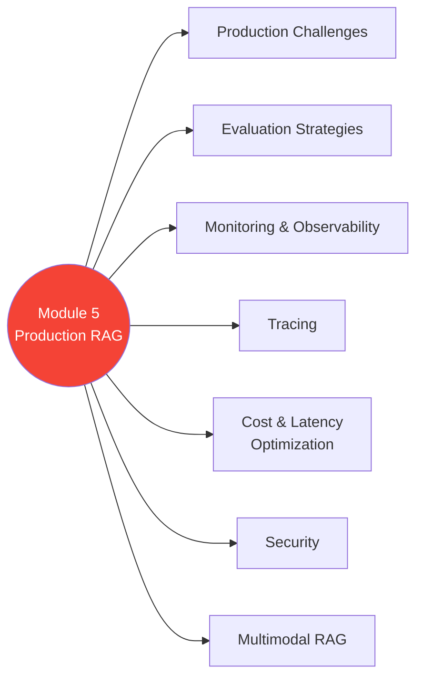

# 🚀 Module 5 — RAG Systems in Production

> Lab se production tak — evaluation, monitoring, security, optimization sab yahan! 🏭

---

## 🧠 Brain — Module Overview

```mermaid
graph LR
    M5(("Module 5<br/>Production RAG"))
    M5 --> CHAL["Production Challenges"]
    M5 --> EVAL["Evaluation Strategies"]
    M5 --> MON["Monitoring & Observability"]
    M5 --> TRACE["Tracing"]
    M5 --> OPT["Cost & Latency<br/>Optimization"]
    M5 --> SEC["Security"]
    M5 --> MM["Multimodal RAG"]

    style M5 fill:#f44336,color:#fff
```

## 📊 Progress

| # | Lesson | Confidence | Revised |
|---|--------|-----------|---------|
| 01 | [Production Challenges](01-production-challenges.md) | 🔴 | — |
| 02 | [Observability & Evaluation](02-observability-evaluation.md) | 🔴 | — |
| 03 | [Custom Evaluation Datasets](03-custom-eval-datasets.md) | 🔴 | — |
| 04 | [Quantization](04-quantization.md) | 🔴 | — |
| 05 | [Cost vs Quality](05-cost-vs-quality.md) | 🔴 | — |
| 06 | [Latency vs Quality](06-latency-vs-quality.md) | 🔴 | — |
| 07 | [Security](07-security.md) | 🔴 | — |
| 08 | [Multimodal RAG](08-multimodal-rag.md) | 🔴 | — |
| 09 | [Lab: Improving Chatbot](09-lab-improving-chatbot.md) | 🔴 | — |

**Overall confidence:** 🔴 Just started (7/9 lessons created)

## 🧩 Memory Fragments
> - 🏭 **6 production challenges:** Scale, unpredictable prompts, messy data, security, adversarial attacks, business impact
> - 📊 **Observability 2D grid:** (Scope: Component vs System) × (Evaluator: Code-based, LLM-as-a-judge, Human feedback)
> - 🔄 **Custom dataset flywheel:** Observe production → Evaluate by topic → Experiment on real prompts → Deploy → Repeat
> - 📂 **Topic clustering:** Embed prompts → k-means/HDBSCAN → segment metrics by topic to find weak spots
> - 🛠️ **Phoenix (Arize):** Open-source observability platform for RAG systems (tracing, clustering, evals)
> - 🗜️ **Quantization:** 8-bit = 50% LLM size, 4× smaller vectors, <3% quality drop — default choice
> - 🪆 **Matryoshka embeddings:** Dims sorted by info density — use first 100 for speed, full 1000 for quality, hybrid = best
> - 💰 **Cost optimization:** Smaller LLMs, reduce tokens (top-k + prompt length), dedicated hardware at scale, multi-tenancy
> - ⚡ **Latency = 70-80% LLM generation** — optimize core LLM first (smaller models, router, caching), retriever already fast
> - 🔒 **Security threats:** Prompt injection, cloud leaks, DB breaches. Defenses: Auth + Multi-tenancy + On-prem + Encryption
> - 🛡️ **Vector encryption challenge:** Vectors must stay unencrypted for ANN — focus on perimeter security, encrypt chunks

---

## 🎬 Teach Mode

| # | Lesson | What You'll Get |
|---|--------|-----------------|
| 01 | Production Challenges | 6 major challenges: scale, unpredictable prompts, messy data, security, adversarial attacks, business impact |
| 02 | Observability & Evaluation | 2D framework (Scope × Evaluator Type), aggregate stats vs detailed logs |
| 03 | Custom Evaluation Datasets | Real-world prompts, clustering by topic, flywheel (Observe → Evaluate → Experiment → Deploy) |
| 04 | Quantization | LLM (16-bit → 8-bit/4-bit), vectors (32-bit → 8-bit/1-bit), Matryoshka (variable dims) |
| 05 | Cost vs Quality | LLM strategies (smaller models, reduce tokens, dedicated hardware), vector DB (RAM/disk/cloud tiers, multi-tenancy) |
| 06 | Latency vs Quality | Latency breakdown (70-80% LLM), optimization priority (core LLM → transformers → retriever), router LLM, caching |
| 07 | Security | 3 attack vectors (prompt injection, cloud leaks, DB breach), defenses (auth, multi-tenancy, on-prem, encryption) |
| 08 | Multimodal RAG | Images, audio, video in RAG (coming soon) |
| 09 | Lab: Improving Chatbot | Optimizing RAG chatbot (coming soon) |

**Supporting:** [Flashcards](flashcards.md)

---

## 📚 Source
> 🎓 [RAG Course — Module 5](https://learn.deeplearning.ai/courses/retrieval-augmented-generation) — DeepLearning.AI

## 🔗 Connected Topics
> ← [Module 4: LLMs & Text Generation](../module-4-llms-text-generation/) · [System Design](../../system-design/)
