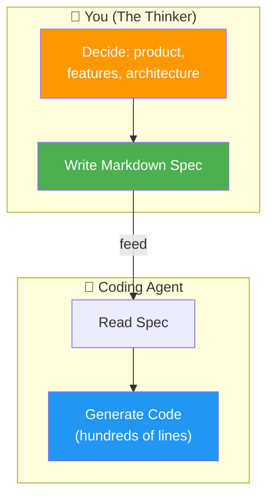
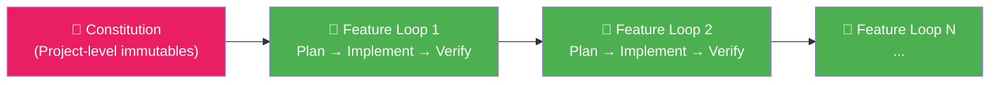
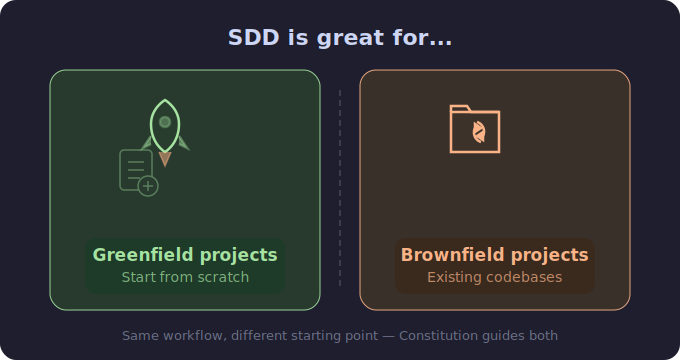
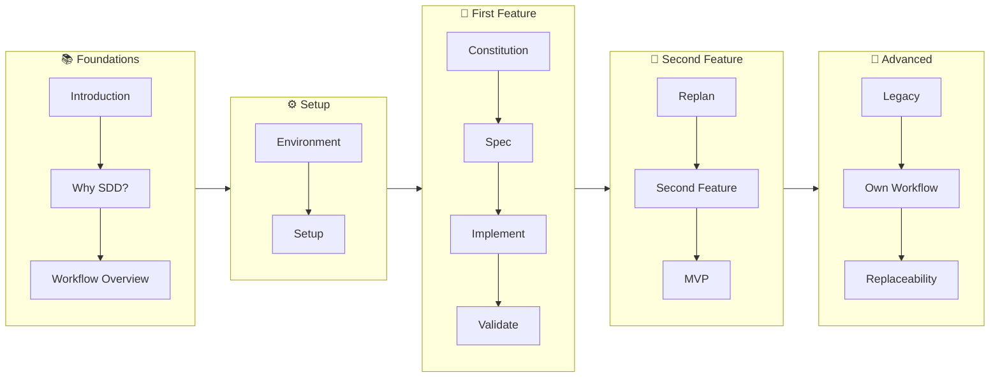

# 01 · Introduction to Spec-Driven Development 📋

---

## 🎯 One Line

> **Write a markdown spec defining what to build → feed it to a coding agent → it implements that spec.** You focus on context, not code.

---

## 🖼️ The Big Picture



> 💡 *Tere paas context hai, agent ke paas speed. Dono milke kaam karo — tu soch, woh type kare!* 😎

---

## ⚡ Three Killer Benefits of SDD

| # | Benefit | What It Means | Example |
|---|---------|---------------|---------|
| 1 | **Downstream Amplification** 📢 | One spec line → hundreds of code lines changed | `"Use SQLite with Prisma ORM"` → change to `"MongoDB"` → entire data layer rewrites itself |
| 2 | **Context Preservation** 🧊 | Specs survive across sessions; agents don't | Agents are **stateless** — every new session starts from zero. The spec loads the non-negotiables at boot. |
| 3 | **Intent Fidelity** 🎯 | You define the problem + constraints → agent elaborates a fuller plan | You set success criteria; agent fills in implementation details aligned to YOUR vision |

> 💡 *Spec likhna = ek baar soch le, phir agent baar baar sahi kaam karega. Bina spec? Agent apni marzi chalayega!* 😂

---

## 🔄 The SDD Workflow (30,000 ft)



| Step | What Happens |
|------|-------------|
| **Constitution** | Define immutable project standards (tech stack, architecture, conventions) |
| **Feature Loop** | Each feature gets its **own branch** with: plan → implement → verify |
| **Clean Slate** | Each loop leaves a clean slate — reduces headaches & context switching |

---

## 🏗️ Greenfield vs Brownfield

<p align="center">
  
</p>

| | Greenfield 🌱 | Brownfield 🏭 |
|---|---|---|
| **Starting point** | From scratch | Existing codebase |
| **Constitution** | Develop in conversation with agent | Generate from existing code |
| **Then what?** | Feature loops (plan → implement → verify) | Same feature loops |

> Both converge on the same workflow — the only difference is how the constitution is born.

---

## 🧠 Why Bother Writing Specs? (The ROI)

```
Agent coding time:     20–30 minutes  (= hours of human dev work)
Spec writing time:     3–4 minutes

Without spec → agent picks randomly → weird products, contradictory code
With spec    → agent follows YOUR intent → maintainable, coherent code
```

**Real-world horror story:** Teams with no spec → multiple coding agents under different developers → building quickly but in **contradictory ways** → downstream headaches everywhere.

---

## 📝 How to Write a Spec

| Step | Action |
|------|--------|
| 1 | **Converse** with an agent (Claude Code, Gemini, ChatGPT Codex) |
| 2 | Make **key architectural choices** using YOUR knowledge of trade-offs |
| 3 | Agent **summarizes** the key decisions into a markdown file |
| 4 | That markdown file = your spec = the **constitution** |

> Writing a spec requires **thinking** — you decide product, features, architecture. Hard work, but the alternative is chaos.

---

## ⚠️ Without a Spec...

- ❌ Important decisions left to **agent's whims**
- ❌ Multiple agents build in **contradictory ways**
- ❌ Code becomes **unmaintainable**
- ❌ Products turn out **weird**
- ⚡ Maybe OK if rolling the dice, but NOT for serious software

---

## 🔑 Key Terms

| Term | Definition |
|------|-----------|
| **Spec-Driven Development** | Workflow where you write a markdown spec → agent implements it |
| **Constitution** | Project-level document defining immutable standards (tech stack, conventions, architecture) |
| **Feature Loop** | Isolated cycle: plan → implement → verify, one feature per branch |
| **Downstream Amplification** | Small spec changes cascading into large code changes |
| **Context Decay** | Loss of project context between agent sessions (agents are stateless) |
| **Intent Fidelity** | How accurately the agent's output matches what you actually wanted |
| **Greenfield** | Building a project from scratch |
| **Brownfield** | Working with an existing codebase |
| **Agent Skills** | Custom automations you write to streamline your SDD workflow |

---

## 🗺️ Course Roadmap (What's Coming)



---

> **Next →** [Why Spec-Driven Development?](02-why-sdd.md)
