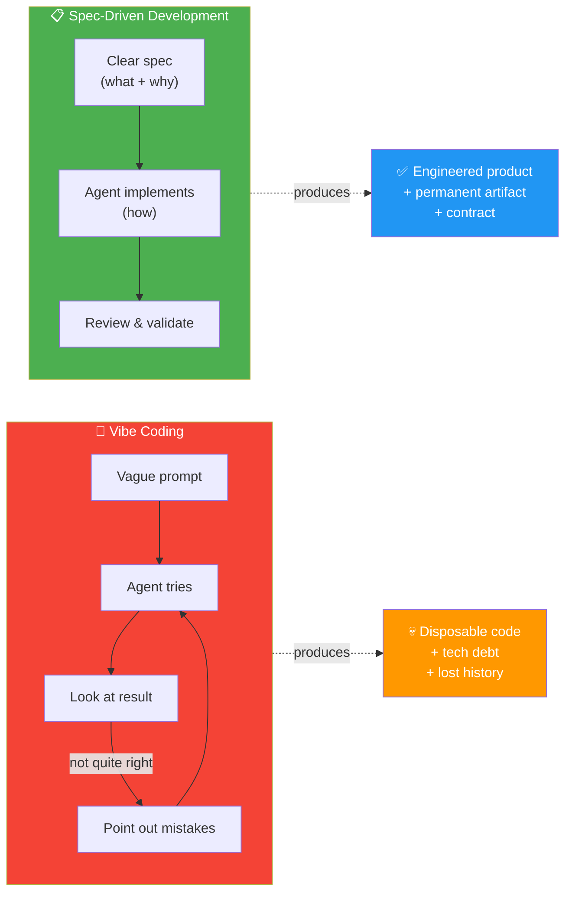
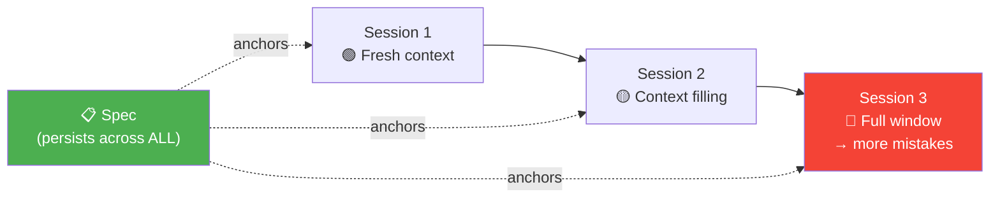

# 02 · Why Spec-Driven Development? 🤔

---

## 🎯 One Line

> **Vibe coding = fast but disposable. SDD = engineering brought back to AI-assisted coding.** Specs decouple the *what/why* from the *how*.

---

## 🖼️ Vibe Coding vs Spec-Driven Development



> 💡 *Vibe coding = "bana de kuch" aur phir "yeh nahi, woh kar." SDD = pehle soch, phir bol — ek baar mein sahi!* 😂

---

## ⚖️ The Core Comparison

| | 🎲 Vibe Coding | 📋 Spec-Driven Development |
|---|---|---|
| **Input** | High-level prompt ("create me a button") | Detailed spec (what, why, constraints, success criteria) |
| **Process** | Prompt → hope → fix → repeat | Spec → implement → validate |
| **History** | Long dialogue, **not even saved** | Permanent technical artifact |
| **Scales?** | ❌ OK for a button, not for a project | ✅ Works for large ongoing projects |
| **Output** | Disposable code + tech debt | Engineered, maintainable code |
| **Who decides?** | Agent guesses | **You** define, agent follows |

---

## 🧬 The Paradigm Shift

```
┌─────────────────────────────────────────────┐
│  SPECIFICATION  (what + why)  →  YOU write   │
│─────────────────────────────────────────────│
│  IMPLEMENTATION (how)         →  AGENT codes │
└─────────────────────────────────────────────┘

       ↑ DECOUPLED — this is the key insight
```

> **SDD is the professional response to the chaos of unsupervised AI generation.**

Your main task as a human shifts: **learn to convert your intentions into clear specifications.**

---

## ⚡ Three Benefits (Expanded from L01)

| # | Benefit | Deep Dive |
|---|---------|-----------|
| 1 | **Downstream Amplification** 📢 | A few sentences about look & feel → hundreds of lines of CSS. Reduces **cognitive overhead** of working with ultra-fast coding agents. |
| 2 | **No Context Decay** 🧊 | Agent's context window fills up → more mistakes as it copes with full working memory. Specs **persist between sessions AND agents** — anchor to core context. |
| 3 | **Intent Fidelity** 🎯 | Specs force you to define problem, success criteria, constraints, user flows **before** agent starts generating. Result: code matches your goals. |

### Context Decay — Why It's Worse Than You Think



> Specs persist between sessions **and even agents** — switch from Claude Code to Codex and the spec still works.

---

## 🔑 The Compiler Analogy

```
Traditional:   Source Code  ──[Compiler]──►  Machine Code
SDD:           Specs        ──[Agent]────►   Source Code
```

| Aspect | Compiler | SDD Agent |
|--------|----------|-----------|
| **Input** | Human-readable source code | Human-readable specs (markdown) |
| **Output** | Machine code | Source code |
| **Benefit** | Abstraction from hardware | Abstraction from implementation |
| **Stakeholders** | Developers only | **Anyone** — specs are in human language |

> Even better than compilers: specs are in **human language**, making them accessible to stakeholders, PMs, and non-developers.

---

## 💡 Key Distinctions

**Specs are NOT just prompts:**

| | Prompt | Spec |
|---|---|---|
| **Lifespan** | Dies with the chat session | **Permanent** technical artifact |
| **Scope** | One interaction | Entire project / feature |
| **Structure** | Freeform | Formalized (mission, constraints, criteria) |
| **Audience** | Just the agent | Humans + agents |
| **Reusable?** | ❌ | ✅ Across sessions AND agents |

---

## ⚠️ The Scaling Problem with Vibe Coding

- ✅ Works for: a button, a quick prototype, a throwaway demo
- ❌ Breaks for: large ongoing projects, team collaboration, production software
- 💀 Result: disposable code, mounting technical debt, lost conversation history
- 🔑 Key insight: **specs are the differentiator between slop and engineering**

---

## 🧪 Quick Check

<details>
<summary>❓ What is the "paradigm shift" in SDD?</summary>

Specification (what + why) is **decoupled** from Implementation (how). You write the spec, the agent handles implementation. Your job shifts from writing code to writing clear specifications.
</details>

<details>
<summary>❓ Why is context decay a problem, and how do specs solve it?</summary>

As you work with a coding agent, its context window fills up → more mistakes. Specs **persist between sessions and agents**, anchoring the agent to core context needed for the codebase and feature. They're like a permanent briefing document.
</details>

<details>
<summary>❓ How is SDD like a compiler?</summary>

Compilers convert source code → machine code. SDD agents convert specs → source code. Both provide abstraction. But specs are even better — they're in **human language**, accessible to anyone (PMs, stakeholders, not just devs).
</details>

---

> **Next →** [Workflow Overview](03-workflow-overview.md)
