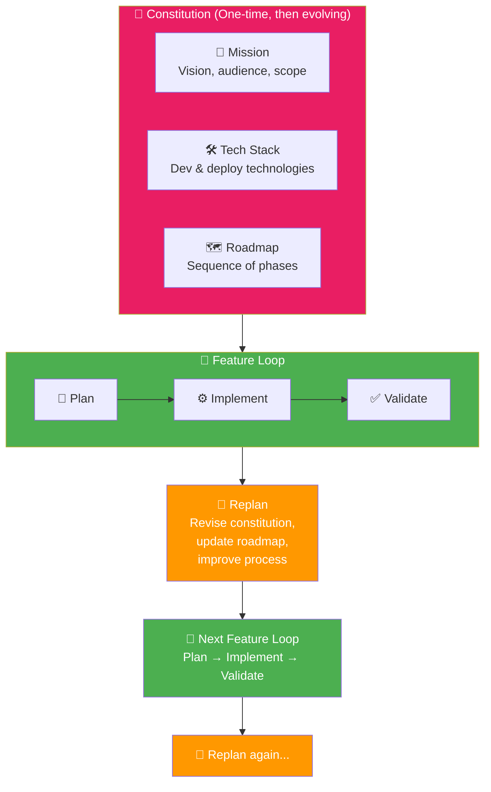
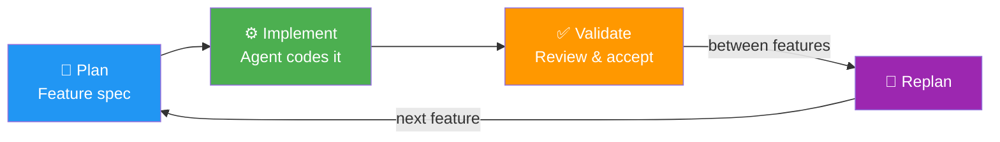

# 03 · Workflow Overview 🔄

---

## 🎯 One Line

> **Constitution (project-level decisions) → Feature Loops (plan → implement → validate) → Replan → Repeat.** You're the architect, the agent is the builder.

---

## 🖼️ The Full SDD Workflow



> 💡 *Constitution ek baar banao, phir feature-by-feature build karo. Har loop ke baad sudhar karo — yeh hai SDD ka chakra!* 🔄

---

## 📜 The Constitution — Three Pillars

| Pillar | What It Captures | Why It Matters |
|--------|-----------------|----------------|
| **🎯 Mission** | Vision, target audience, scope, the "why" | Guides ongoing decisions — everyone knows the destination |
| **🛠️ Tech Stack** | Dev & deployment technologies, constraints | Common understanding for the engineering team |
| **🗺️ Roadmap** | Sequence of phases, each with its own feature spec | **Living document** — evolves with replanning |

### Constitution vs agents.md

| | `agents.md` | **Constitution** |
|---|---|---|
| **Scope** | Agent-specific instructions | Project-level decisions |
| **Audience** | One specific coding agent | **Agent-agnostic** — works with any agent |
| **Structure** | Varies by agent/tool | More structured & formalized |
| **Agreement** | Human → agent | Human ↔ agent **AND** human ↔ human |

> The Constitution captures agreement on key decisions between human and agent, **but also between humans** on the team.

---

## 🔁 The Feature Loop



| Phase | What Happens |
|-------|-------------|
| **Plan** | Write a feature spec — what to build, constraints, acceptance criteria |
| **Implement** | Agent codes from the spec |
| **Validate** | Review results — accept or ask for changes |
| **Replan** | Revise constitution, update roadmap, improve the process itself |

---

## 🎯 The Key Skill: Right Level of Detail

```
┌──────────────────────────────────────────────┐
│           WHAT YOU PROVIDE (HIGH)             │
│  Goals, mission, target audience, constraints │
│  Architecture decisions, success criteria     │
├──────────────────────────────────────────────┤
│         WHAT AGENT FIGURES OUT (LOW)          │
│  Variable names, function signatures,         │
│  implementation details, boilerplate          │
└──────────────────────────────────────────────┘
```

**Rule of thumb:** Treat the agent as a **highly capable pair programmer**.
- ✅ Lots of context about **goals, mission, audience, constraints**
- ❌ Less about **low-level decisions** the agent can figure out

---

## 🏗️ The Architect Analogy

| Role | You (Architect) | Agent (Builder) |
|------|-----------------|-----------------|
| **Design** | ✅ Detailed drawings (spec) | — |
| **Build** | — | ✅ Construction (code) |
| **Supervise** | ✅ Oversee progress | — |
| **Review** | ✅ Accept or request changes | — |

> **Focus on providing the context the builder doesn't know.** Don't tell them how to do their job.

---

## ⚠️ Key Insight: Replanning Is Part of the Loop

Replanning isn't just "let's plan the next feature" — it's a **meta-improvement step**:

| What Gets Revised | Example |
|-------------------|---------|
| Constitution | Update mission scope based on learnings |
| Roadmap | Re-prioritize remaining features |
| **Process itself** | Improve how you write specs, validate, etc. |

> SDD keeps you **improving from there** — it's not a one-shot workflow.

---

## 🧪 Quick Check

<details>
<summary>❓ What are the 3 pillars of the SDD Constitution?</summary>

**Mission** (the why — vision, audience, scope), **Tech Stack** (dev & deploy technologies), **Roadmap** (sequence of phases). The constitution is agent-agnostic and captures agreement between humans AND between human and agent.
</details>

<details>
<summary>❓ How is a Constitution different from agents.md?</summary>

`agents.md` is agent-specific instructions for one tool. A Constitution is **agent-agnostic**, more structured, and captures project-level decisions agreed upon by both humans and agents.
</details>

<details>
<summary>❓ What's the "right level of detail" rule of thumb?</summary>

Treat the agent as a **highly capable pair programmer**. Give lots of context about goals, mission, audience, and constraints. Give less about low-level implementation details the agent can figure out on its own.
</details>

---

> **Next →** [Set Up Your Environment](04-setup-environment.md)
