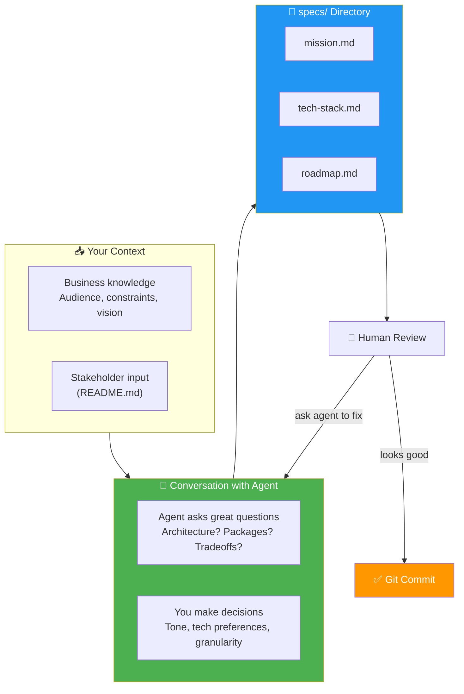
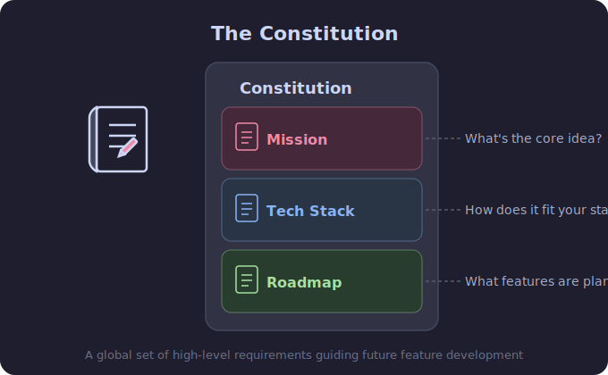
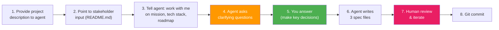

# 06 · Creating the Constitution 📜

---

## 🎯 One Line

> **Write the Constitution WITH the agent, not alone.** Mission (why) + Tech Stack (how) + Roadmap (when) → three files in `specs/` that guide everything.

---

## 🖼️ The Constitution Creation Flow

> 💡 *Constitution akele mat likho — agent ke saath conversation mein likho. Agent ke questions sunke tum bhi surprise hoge!* 🤯

---

## 📜 What Goes in Each File

  

| File | Contains | Key Insight |
|------|----------|-------------|
| **mission.md** | Vision, target audience, scope, problems to solve, constraints | Stuff the agent **can't know** — your business context |
| **tech-stack.md** | Architecture decisions, API pipelines, DB schema, treatments/data catalogs, smoke tests | Separates engineering from business; **headache to change later** |
| **roadmap.md** | Sequence of phases, each as a feature spec | **Living document** — evolves with replanning; keep steps small |

---

## 🛠️ How to Actually Write It (Step by Step)

### The Prompt to the Agent

| Element | What to Include |
|---------|----------------|
| **Project description** | What you're building, why |
| **Stakeholder input** | Reference existing docs (e.g., README.md) |
| **Constitution structure** | "Work with me on a mission, tech stack, and roadmap" |
| **Roadmap granularity** | "Organize the roadmap in small steps" |
| **Optional** | Mention `AskUserQuestion` tool for nicer Q&A interface |

---

## ❓ What the Agent Asks (Examples)

The agent asks **surprisingly good questions** you might not have considered:

| Question Area | Example |
|---------------|---------|
| **Tone** | "What tone should mission.md take?" → Playful |
| **Tech preferences** | "Backend language?" → TypeScript (team is used to it) |
| **Granularity** | "How granular should the roadmap be?" → Small steps |
| **Architecture** | Patterns you hadn't considered |
| **Packages** | External packages that already do the work |
| **Tradeoffs** | Speed vs data fidelity, security vs convenience |

---

## 🏥 Example Project: AgentClinic

> A parody of Pet Clinic — a clinic where AI agents get relief from their humans 😂

| Detail | Value |
|--------|-------|
| **Stack** | Next.js backend + React frontend |
| **Features** | Manage appointments, ailments (hallucination, context rot), treatments (context infusion, temperature reduction) |
| **Agent problems** | Hallucinations, context rot, memory issues, sub-agent coordination |

### What the Detailed Spec Includes

| Section | Example Detail |
|---------|---------------|
| **Problems to solve** | Agents check in via API, issues persist over time → track treatment effectiveness |
| **Visit lifecycle** | Includes TRIAGE step + FOLLOW-UP with 3 possible states |
| **Ailment catalog** | Codes, severity levels, custom ailments when symptoms don't match (>0.6 similarity threshold) |
| **API pipeline** | Full flow for POST `/visits` — validate request, search previous visits, etc. |
| **DB schema** | All tables defined upfront (headache to change later!) |
| **Treatment mapping** | Which ailments get which treatments |
| **Smoke tests** | E.g., chronic ailments are detected |
| **Treatment effectiveness** | Exact algorithm specified |

---

## 🔍 Agent as Spec Reviewer

The agent doesn't just write — it **reviews for inconsistencies**:

| What Agent Found | Resolution |
|-----------------|------------|
| Threshold inconsistency in diagnosis flow | Confirmed: 0.4–0.6 confidence = included but flagged as uncertain |
| Dashboard security question | Unprotected is fine — deploying privately in secure environment |
| LLM provider choice | Leave configurable — new models release fast |
| Archiving behavior | Soft-delete — most flexibility for later |
| Mission/tech-stack alignment | Environment variable for LLM should match in both docs |
| Prescription payloads | Add `schema_version` now — lightweight change, big payoff later |
| SSE reconnection | Accept stale state — full refresh pulls fresh state anyway (good enough for MVP) |

---

## ⚠️ Critical Best Practices

| Practice | Why |
|----------|-----|
| **Don't edit specs manually** | Ask the agent to make changes → keeps all artifacts consistent. Manual edits risk missing related documents. |
| **Review before committing** | Human-in-the-loop is essential. Agent may miss business context (e.g., target audience). |
| **Agent asks for write permissions** | Keeps changes under your control. Can approve all instances of a command per session if comfortable. |
| **Commit the Constitution** | It's a living document — git tracks its evolution. |
| **Detailed specs can be long** | Normal. This technique pays off downstream. |
| **Two versions: detailed vs pared down** | Start detailed, generate lighter version for daily use. Both have value. |

---

## 🧪 Quick Check

❓ Why should you write the Constitution WITH the agent instead of alone?

The agent asks great questions you might not have considered — architecture patterns, external packages, tradeoffs. It's a collaborative process where your business context meets the agent's technical knowledge. The conversation produces better specs than either could write alone.

❓ Why should you ask the agent to edit specs instead of editing manually?

To keep all artifacts **consistent**. If you edit mission.md manually, you might miss updating related references in tech-stack.md or roadmap.md. The agent tracks cross-references across documents.

❓ What's the benefit of defining the DB schema in the constitution upfront?

It's a **headache to update the schema later**. Getting it right in the constitution means the agent builds features on a stable data foundation from day one.

---

> **Next →** [Feature Specification](07-feature-specification.md)
