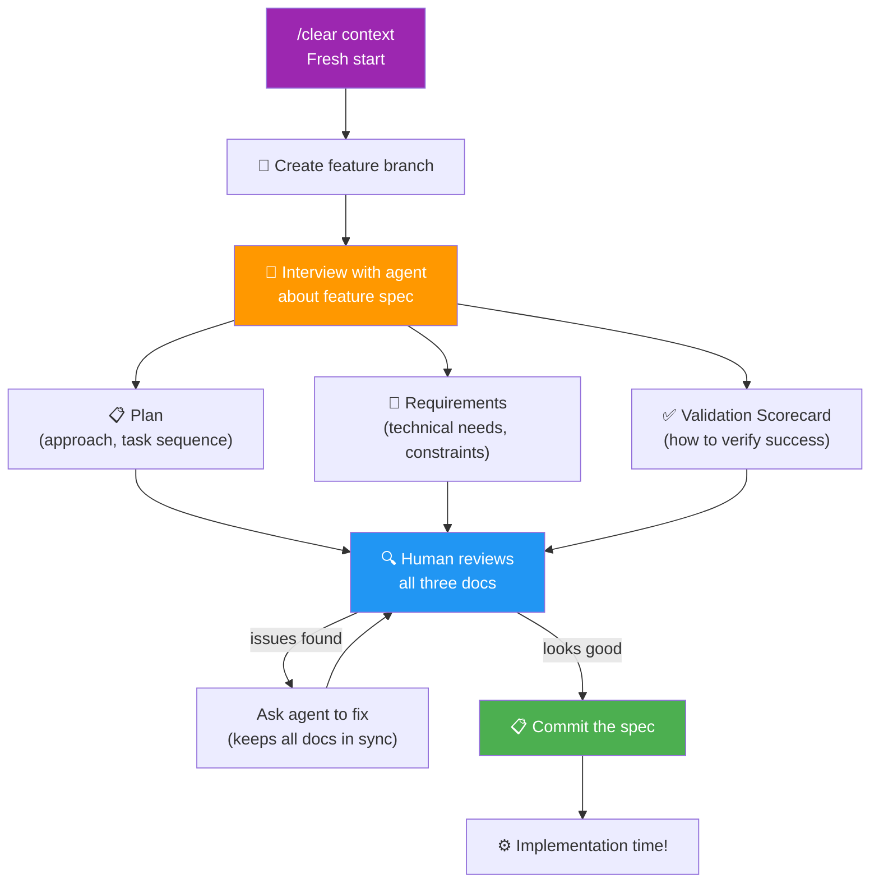

# 07 · Feature Specification 📝

---

## 🎯 One Line

> **Before coding, discuss the spec with the agent: a plan for tasks, requirements, and a validation scorecard.** Feature branch, fresh context, constitution as the source of truth.

---

## 🖼️ The Feature Spec Process



> 💡 *Coding se pehle spec likho — yahan ka 3 minute wahan ke 300 lines of code bacha dega!* ⏱️

---

## 📄 Three Feature Spec Documents

| Document | What It Contains | Key Rule |
|----------|-----------------|----------|
| **Plan** | Approach, sequence of work (task groups) | Outlines HOW the feature will be built, step by step |
| **Requirements** | Technical needs, constraints, pinned versions | Important details but NOT minor things like variable names |
| **Validation** | Scorecard — how to verify the feature works | Agent needs to know how to check it got things right |

> All three stay in sync — when you change one via the agent, it updates the others too.

---

## 🛠️ Step by Step

| # | Step | Detail |
|---|------|--------|
| 1 | **Fresh context** | `/clear` — agent gets what it needs from the constitution, not stale memory |
| 2 | **Feature branch** | Tell agent to work on a separate branch |
| 3 | **Prompt for spec** | Ask agent to discuss: plan for tasks, requirements, validation scorecard |
| 4 | **Agent interviews you** | Key decisions — pay attention to conflicts/problems |
| 5 | **You don't have to agree** | Agent proposes solutions, but YOU decide. Clarify anything that bothers you. |
| 6 | **Review all three docs** | Plan → Requirements → Validation |
| 7 | **Fix via agent** | Found something wrong? Ask agent — keeps all docs in sync |
| 8 | **Commit the spec** | Small step, then on to implementation |

---

## ⚖️ The Right Level of Control

```
┌────────────────────────────────────┐
│  ✅ CONTROL                        │
│  • Phase scope decisions           │
│  • Pinned versions (e.g., Hono)    │
│  • Strict TypeScript enforcement   │
│  • Validation method (manual curl) │
│  • "I want a nice placeholder page"│
├────────────────────────────────────┤
│  ❌ DON'T OVERSTEER                │
│  • Variable names                  │
│  • Minor implementation details    │
│  • Internal function structure     │
└────────────────────────────────────┘
```

> **Control the process, don't oversteer the agent.** Don't speed through requirements, but don't micromanage either.

---

## 🔍 Review Tips

| What to Review | What to Check |
|---------------|---------------|
| **Plan** | Is the approach right? Task sequence logical? Get this right early — keeps agent on track. |
| **Requirements** | Technical needs captured? Constraints clear? No minor details cluttering it. |
| **Validation** | Can the agent actually verify success? Realistic checks? |

### When You Find Issues

- **Don't edit manually** → ask the agent to fix
- Agent keeps **requirements and validation in sync** with plan changes
- Example: adding a "nice placeholder homepage" → agent updates plan, requirements, AND validation

---

## 💡 Key Insights

| Insight | Why |
|---------|-----|
| **"Too early to start coding"** | Feature is on the roadmap, but spec comes first |
| **Constitution = source of truth** | Agent reads constitution for context, not stale chat history |
| **Time here is well spent** | Spec changes expand into hundreds of lines of code downstream |
| **You don't have to agree** | Agent proposes, you decide. Your knowledge > agent's guesses. |

---

## 🧪 Quick Check

<details>
<summary>❓ What are the three documents in a feature spec?</summary>

1. **Plan** — approach and sequence of tasks. 2. **Requirements** — technical needs and constraints. 3. **Validation scorecard** — how to verify the feature works. All three stay in sync when you edit via the agent.
</details>

<details>
<summary>❓ Why start with /clear and constitution before writing a feature spec?</summary>

`/clear` gives the agent **fresh context** — it reads what it needs from the constitution (the official source), not stale memory snapshots. This ensures specs capture **intent**, not artifacts of previous work.
</details>

<details>
<summary>❓ What does "control the process but don't oversteer" mean?</summary>

Make key decisions (scope, pinned versions, validation method) but **don't micromanage** minor details like variable names. Agent proposes solutions — you decide on the important stuff, let the agent handle the rest.
</details>

---

> **Next →** [Feature Implementation](08-feature-implementation.md)
