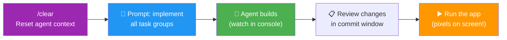

# 08 · Feature Implementation ⚙️

---

## 🎯 One Line

> **Clear context → prompt agent with the full feature spec → watch it build → review in real time.** You're the supervisor, not the coder.

---

## 🖼️ The Implementation Flow



> 💡 *Agent code likh raha hai, tum console mein real-time dekh rahe ho — supervisor mode ON!* 🧑‍💼

---

## 🛠️ Step by Step

| # | Step | Detail |
|---|------|--------|
| 1 | **Clear context** | `/clear` command — fresh start, avoid stale context contaminating the build |
| 2 | **Review the feature spec** | Quick refresh on what the plan asks for (task groups, requirements) |
| 3 | **Prompt to implement** | Tell agent to implement all task groups from the spec |
| 4 | **Watch in real time** | Agent displays changes in console as it works |
| 5 | **Review in commit window** | Early jump on reviewing — see what changed before formal validation |
| 6 | **Run the app** | Start the server, see pixels on screen |

---

## ⚡ All At Once vs One Task Group at a Time

| Strategy | When to Use |
|----------|------------|
| **All task groups at once** | Standard features, confident in the spec |
| **One task group at a time** | Areas where small mistakes compound — **security**, **database management**, sensitive logic |

> Smaller steps = smaller commits = easier to review and catch issues early.

---

## 👷 Your Role During Implementation

```
┌─────────────────────────────────────┐
│  YOU = Architect / Supervisor       │
│                                     │
│  • Provide the clear contract (spec)│
│  • Watch progress in real time      │
│  • Review changes in commit window  │
│  • Run and verify the result        │
│                                     │
│  Agent = Builder                    │
│  • Implements the task groups       │
│  • Provides summary of work done    │
│  • Validates its own changes        │
└─────────────────────────────────────┘
```

---

## ⚠️ Key Takeaways

- **Always `/clear` before implementation** — stale context = stale results
- **The agent provides a summary** with extra details on work performed per task group
- **Agent does its own validation** — but YOUR validation comes next (Lesson 09)
- **"Nano" means nano** — first feature might look like nothing, but pixels on screen = progress 🎉

---

> **Next →** [Feature Validation](09-feature-validation.md)
