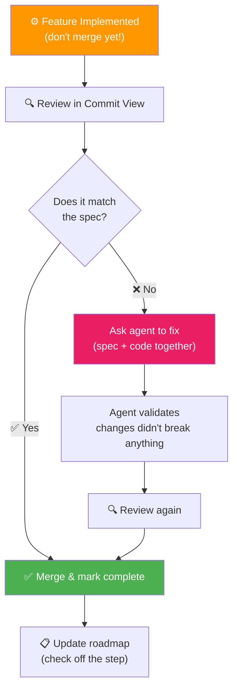
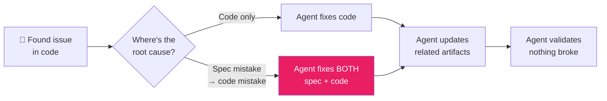

# 09 · Feature Validation ✅

---

## 🎯 One Line

> **Don't merge yet — review with the agent, fix spec AND code together, then merge.** Validation = human-in-the-loop code review that keeps everything in sync.

---

## 🖼️ The Validation Flow



> 💡 *Code review toh pehle bhi karte the — ab bas agent ke saath milke karo. Tum high-level dekho, woh low-level fix kare!* 🔍

---

## 🔍 How to Review (High-Level Focus)

| ✅ Focus On | ❌ Don't Worry About |
|-------------|---------------------|
| Does the feature **work**? | Which CSS classes were used |
| Does it **reflect the spec**? | Variable naming minutiae |
| Are the **conventions** followed? | Boilerplate details |
| Are components **structured correctly**? | Import ordering |

> **Rule:** Start with the commit view. Go through changes with a high-level lens — the spec is your checklist.

---

## 🔄 The Fix Loop: Spec + Code Together

When you find issues, **always ask the agent** to fix them:



### Example from AgentClinic

| Issue Found | Root Cause | Fix |
|-------------|-----------|-----|
| Home.tsx was too minimal ("nano meant nano") | Spec didn't ask for layout sub-components | Agent fixed **both** spec and implementation |
| Sub-components stuffed in one file | Didn't follow conventions | Agent moved to separate files + updated all references |

---

## ⚠️ The Drift Trap

> **Even when a change is "easy in an editor" — don't do it manually!**

```
Manual edit to code
       ↓
Specs, READMEs, other artifacts → OUT OF SYNC
       ↓
Drift accumulates → wastes time later
```

| Temptation | Why Resist |
|-----------|-----------|
| "I'll just move this component myself" | Other artifacts (specs, READMEs) won't know about the change |
| "It's a small rename, I'll do it" | Agent can fix **all mentions** across the project |
| "No need for an agent, right?" | **Wrong.** Even small manual changes cause drift. |

---

## 🧠 Cognitive Debt

**Definition:** The mental load of tracking what your code is doing and how it has evolved.

| Problem | SDD Solution |
|---------|-------------|
| Agents write code **so fast** you can't keep up | Keep changes **manageable** — small feature loops |
| You lose track of what changed | Commit view + spec as checklist |
| Evolution of code is unclear | Spec tracks the "why" alongside the "what" |

> The process should be **fast and easy to control**. If changes aren't manageable, your cognitive debt is growing.

---

## 📋 Versioning: Spec Changes + Code Changes

| Scenario | Strategy |
|----------|---------|
| Small spec update (checking off roadmap step) | ✅ Keep on **same branch** as feature |
| Major constitution update | 🔀 Separate branch |

> How to associate which specs created which code changes is an **evolving topic** in the community.

---

## 🧪 Quick Check

<details>
<summary>❓ Why should you NOT manually edit code even when it's "easy"?</summary>

Manual edits cause **drift** — other artifacts (specs, READMEs, related docs) get out of sync. Ask the agent to make the change so it can update all related mentions and keep everything consistent.
</details>

<details>
<summary>❓ What is cognitive debt, and how does SDD reduce it?</summary>

**Cognitive debt** = the mental load of tracking what your code is doing and how it evolved. SDD reduces it by keeping changes manageable (small feature loops), using specs as review checklists, and having the agent validate that changes didn't break anything.
</details>

<details>
<summary>❓ A bug in the code actually came from a missing requirement in the spec. What do you fix?</summary>

Fix **BOTH** — ask the agent to update the spec (add the missing requirement) and the code (implement it). A code mistake that flows from a spec mistake needs correction at both levels.
</details>

---

> **Next →** [Project Replanning](10-project-replanning.md)
