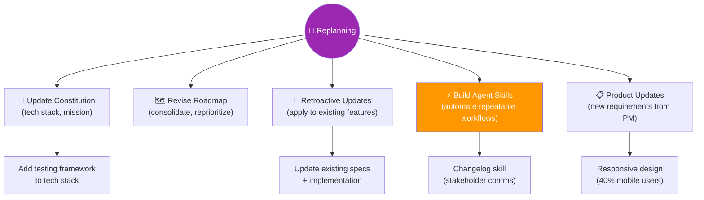
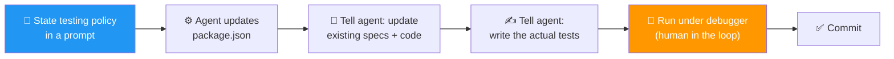
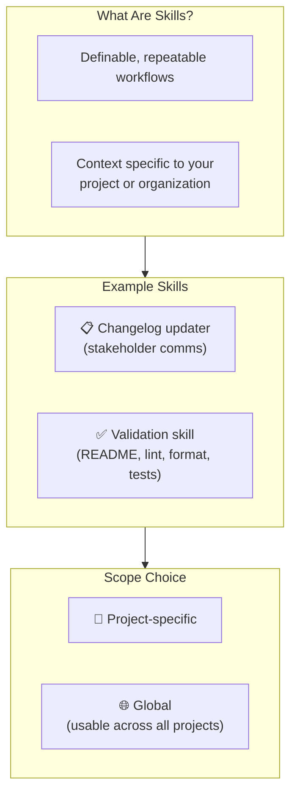

# 10 · Project Replanning 🔄

---

## 🎯 One Line

> **Don't rush to the next feature. Replan: update the constitution, add testing, consolidate roadmap items, and even build agent skills to automate your workflow.**

---

## 🖼️ The Replanning Landscape



> 💡 *"You have to run slow to run fast."* — Pehle ruko, socho, sudhaaro, phir aage badho! 🏃‍♂️

---

## 📋 Three Kinds of Replanning

| Type | What Changes | Example |
|------|-------------|---------|
| **Feature-level** | Specs + code from recent feature | Add testing, fix responsive design |
| **Project-level** | Constitution + roadmap | Consolidate roadmap phases, add new requirements |
| **Workflow-level** | Your SDD process itself | Build agent skills, automate validation steps |

---

## 🧪 Adding Testing (Feature Replanning)



| Step | What Happens |
|------|-------------|
| 1. State your policy | Tell agent your testing preferences (framework, approach) |
| 2. Agent sets up framework | Updates package.json (script only, no dependency yet — note for later!) |
| 3. Apply retroactively | Tell agent to update **existing** feature specs + implementation |
| 4. Write actual tests | Agent sets up tests; didn't write them initially — you have to ask |
| 5. Run in debugger | Step through code execution as part of human-in-the-loop validation |

---

## 📱 Product Updates (New Requirements)

When the product manager sends an update mid-project:

| Scenario | Strategy |
|----------|---------|
| **Small change** (early in development) | Implement directly during replanning |
| **Big change** | Schedule it as its own feature phase on the roadmap |

### Example: Responsive Design

```
Product Manager: "40% of users are on mobile → emphasize responsive design"

Prompt to agent:
  - We want responsive design
  - Correct product specs AND feature specs AND code
  
Result: Agent updates not just code, but ALSO specs
        → specs capture decisions, not just code
        → keeps everything in sync for team communication
```

---

## 🗺️ Roadmap Revision (Project Replanning)

| Action | Example |
|--------|---------|
| **Review upcoming tasks** | Does the next feature still make sense? |
| **Consolidate phases** | Features 2, 3, 4, 5 "hang together" → tackle in one step |
| **Reprioritize** | Move urgent items up, defer nice-to-haves |
| **Use your judgment** | Small updates = just do it. Big changes = new feature phase. |

> **Always commit after roadmap changes** — then start the new feature.

---

## ⚡ Agent Skills (Workflow Replanning)

**Skills = packages of instructions + resources that give agents new capabilities.**



| Aspect | Detail |
|--------|--------|
| **When to use skills** | Definable, repeatable workflows needing project/org context |
| **How to create** | Use the agent to help write the skill (many agents have "skill-writing skills") |
| **Scope choice** | Project-specific or global (usable across all projects) — style choice, learn as you go |
| **Changelog example** | Skill auto-updates CHANGELOG on each merge to main; changelogs = how you talk to stakeholders |
| **Validation example** | Package: README update, linting, formatting, test writing, quality checks |

---

## ⚠️ Key Principles

| Principle | Why |
|-----------|-----|
| **"Run slow to run fast"** | Replanning prevents compounding mistakes |
| **Replanning branch** | Constitution updates get their own branch → track which version produced which code |
| **Small steps, frequent commits** | Keeps review from overloading your brain |
| **Specs capture decisions, not just code** | Keep specs + code in sync for team communication |
| **Most of your work = planning + validation** | Not implementing. Make time between features to replan. |

---

## 🧪 Quick Check

<details>
<summary>❓ What are the three levels of replanning?</summary>

1. **Feature-level** — update specs + code for recent feature (add testing, fix issues).
2. **Project-level** — revise constitution + roadmap (consolidate phases, new requirements).
3. **Workflow-level** — improve your SDD process itself (build agent skills to automate).
</details>

<details>
<summary>❓ When should a new requirement be implemented directly vs scheduled as a new feature?</summary>

**Small change early in development** → implement directly during replanning.
**Big change** → schedule as its own feature phase on the roadmap. Use your judgment.
</details>

<details>
<summary>❓ What are agent skills and when should you create one?</summary>

Skills = packages of instructions + resources giving agents new capabilities. Create one for **definable, repeatable workflows** that need project/org-specific context. Examples: changelog updates on merge, validation (lint, format, test, README update). Can be project-specific or global.
</details>

---

> **Next →** [The Second Feature Phase](11-second-feature-phase.md)
