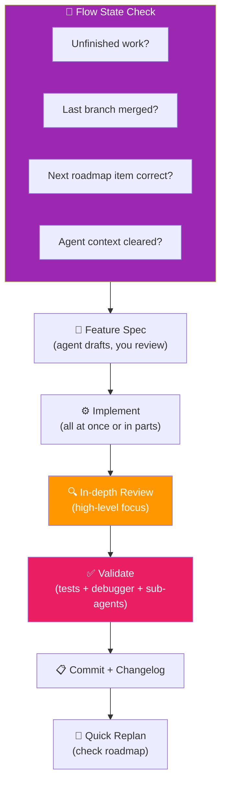

# 11 · The Second Feature Phase 🔁

---

## 🎯 One Line

> **Fight AI fatigue with clean breaks between features, higher-level reviews, and sub-agents for deep validation.** Omissions in specs aren't failures — they're evolution.

---

## 🖼️ The Full Feature Cycle (Second Time)



> 💡 *Har feature ke pehle "saans lo" — clean slate se shuru karo, nahi toh AI fatigue maar degi!* 😤

---

## 😵 AI Fatigue — The Real Problem

**Definition:** The exhaustion from reviewing massive amounts of agent-generated code.

| Symptom | Cause |
|---------|-------|
| So much to review | Agent generates huge diffs |
| Confusion about what changed | Changes across many files |
| Skipping review ("looks fine") | Mental exhaustion → missed bugs |

### The Cure: Clean Breaks Between Features

```
┌─────────────────────────────────────────┐
│  🧘 FLOW STATE CHECKLIST (before start) │
│                                         │
│  ☐ Unfinished work cleared?             │
│  ☐ Last feature branch merged to main?  │
│  ☐ Next roadmap item still correct?     │
│  ☐ Agent context /clear'd?              │
│    → Specs capture intent,              │
│      NOT memory snapshots               │
│    → Focus limited context budget       │
│      on NEXT work only                  │
│                                         │
│  Take a moment to start well.           │
└─────────────────────────────────────────┘
```

---

## 📝 Feature Spec Phase

| Step | What Happens |
|------|-------------|
| Agent **asks good questions** | Keep all features in one phase? Migration strategy? Validation scope? |
| Agent **drafts the spec** | Watch its reasoning — verbose mode gives more insight into intermediate ideas |
| **You review & refine** | Capture YOUR intent (e.g., "use PicoCSS as CSS framework") |
| **Ask agent to propagate changes** | Ensure other files reflect your edits |
| **Commit the spec** | Let agent write the commit message this time |

> **Division between planning and implementation phases** helps you not overflow context, hours, and agents.

---

## ⚙️ Implementation Strategies

| Scenario | Strategy |
|----------|---------|
| Feature fits in one pass | Implement all at once |
| Feature seems too big | **Ask agent to implement part of the plan first** — keeps changes manageable |

---

## 🔍 Review Style (Reduce AI Fatigue)

| ✅ Do | ❌ Don't |
|-------|---------|
| Stick to **higher-level requirements** | Nitpick variable names |
| Make sure code is **committable under your name** | Obsess over formatting |
| Catch pattern violations (e.g., inline props → standalone types) | Review every CSS rule |
| Ask agent to fix everywhere | Fix one instance manually |

### Omissions ≠ Failures

> "An omission such as extracted prop types isn't a failure."

You are **evolving the spec** as you discover new details. Capturing those discoveries leads to better future results. The spec is a living document.

---

## ✅ Validation: Three Layers Deep


| Layer | Purpose | How |
|-------|---------|-----|
| **Run the app** | Validate changes visually | Start server, check UI |
| **Tests + Debugger** | Prevent cognitive debt — validate you UNDERSTAND the changes | Read tests, step through in debugger |
| **Sub-agent deep review** | Validate you weren't lied to | Agent spawns sub-agents to deeply review entire project with feature change |

### Sub-Agents for Deep Review

| Benefit | Why |
|---------|-----|
| More space to think | Sub-agents focus on review only |
| Preserves main agent context | Deep review doesn't pollute the main context window |
| Second look finds issues | Agent can usually find important issues on a second pass |
| Comes back with recommendations | You decide which to act on |

> 🔑 **Keep this in your tool chest** — sub-agent deep review is a powerful validation technique.

---

## 📋 Post-Feature Steps

| # | Step | Detail |
|---|------|--------|
| 1 | **Commit feature** | Final commit after all validation passes |
| 2 | **Run changelog skill** | Document changes using the skill from L10 |
| 3 | **One more commit** | Changelog update |
| 4 | **Merge branch** | Clean merge to main |
| 5 | **Quick replan** | Check roadmap — does next feature still make sense? |
| 6 | **Take a break** | ☕ Coffee! Clean break between features manages AI fatigue |

---

## 🧪 Quick Check

<details>
<summary>❓ What is AI fatigue, and what's the cure?</summary>

**AI fatigue** = exhaustion from reviewing massive amounts of agent-generated code. The cure: **clean breaks between features** — merge, clear context, check the roadmap, start fresh. Keep changes manageable and review at a high level.
</details>

<details>
<summary>❓ Why use sub-agents for validation instead of doing it in the main agent?</summary>

Sub-agents **preserve the main agent's context window** (deep review is context-heavy). They have more space to think about changes. The agent can usually find important issues during a second look. It validates you "weren't lied to."
</details>

<details>
<summary>❓ Is it a failure when the spec omits something like a coding convention?</summary>

**No.** You are **evolving the spec** as you discover new details. Capturing those discoveries (e.g., "extracted prop types instead of inline") leads to better future results. The spec is a living document.
</details>

---

> **Next →** [The MVP](12-the-mvp.md)
