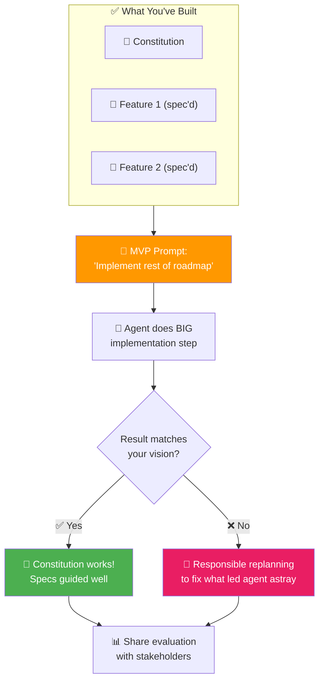

# 12 · The MVP 🚀

---

## 🎯 One Line

> **Implement the rest of the roadmap in one big chunk — but ONLY if your constitution and specs are solid.** The MVP is the ultimate stress test of your SDD work.

---

## 🖼️ The MVP as a Constitution Stress Test



> 💡 *MVP = teri mehnat ka litmus test. Agar agent sahi banaye toh constitution solid hai, nahi toh replan karo!* 🧪

---

## ⚡ When to Attempt a Big Chunk

| ✅ Only If... | ❌ Don't If... |
|---------------|---------------|
| Constitution quality is **high** | You're unsure about your specs |
| Previous feature specs are **solid** | You haven't validated earlier features thoroughly |
| You can **handle the review** | The diff would overwhelm you |
| You're **confident in context quality** | Agent has been going astray on smaller tasks |

> The better the context you provide, the more confident you can be in getting a result **aligned with your intentions**.

---

## 🛠️ The MVP Process

| # | Step | Detail |
|---|------|--------|
| 1 | **Modified feature prompt** | "Implement the rest of the roadmap" + guidance about existing specs |
| 2 | **Agent interview** | Good questions → back-and-forth conversation → Submit Answers |
| 3 | **Review specs before implementation** | Catch incorrect assumptions the agent made to fill gaps |
| 4 | **Commit the plan** | Small steps, frequent commits — even for MVP |
| 5 | **Big implementation step** | Agent does a LOT of work |
| 6 | **Run the app** | Showtime! See the MVP in action |
| 7 | **Agent validates specs** | Ask agent to validate specs against implementation (not just code review) |
| 8 | **Share with stakeholders** | Evaluation of where MVP found holes in planning |
| 9 | **Merge or archive** | Depends on stakeholder review |

---

## 🔍 MVP Validation Is Different

| Regular Feature | MVP |
|----------------|-----|
| You validate the code results | **Agent validates the specs** |
| Focus on "does it work?" | Focus on "where are the holes in our planning?" |
| Fix issues immediately | Share evaluation with stakeholders for their review |

> The agent showed places where the **MVP found holes in our planning** — this evaluation is valuable output to share with stakeholders.

---

## 📊 What the MVP Proves

```
Constitution + 2 Feature Specs + MVP prompt
                    ↓
    Useful demo driven by sample data
                    ↓
    Proof that SDD guidance WORKS
```

| If MVP is good... | If MVP drifts... |
|-------------------|------------------|
| Constitution and specs guided well | Need **responsible replanning** to eliminate what led agent astray |
| Context quality was high enough | Gaps in specs → agent filled with incorrect assumptions |
| Ready for continued development | Fix the root cause before building more features |

---

## ⚠️ Key Takeaway

> **The MVP is an extreme test of your constitution and completed feature specs.** If the result matches your vision, your SDD foundation is solid. If not, that's valuable information — replan responsibly.

---

> **Next →** [Legacy Support](13-legacy-support.md)
