# 13 · Legacy Support 🏭

---

## 🎯 One Line

> **SDD works for legacy projects too — agent reverse-engineers a Constitution from existing code, then you follow the same feature loops.** The spec becomes the project's memory.

---

## 🖼️ Brownfield SDD Flow

```mermaid
graph TB
    subgraph LEGACY["🏭 Existing Project"]
        CODE["📂 Existing codebase"]
        README["📄 README.md"]
        TODO["📋 TODO.md / issues / docs"]
        COMMITS["📜 Git history"]
    end

    LEGACY --> AGENT["🤖 Agent explores & <br/>reverse-engineers"]
    
    AGENT --> CONST["📜 Constitution<br/>(mission + tech stack + roadmap)"]
    
    CONST --> SAME["🔁 Same SDD workflow<br/>as greenfield!"]
    SAME --> FEAT["Feature loops:<br/>Plan → Implement → Validate"]
    FEAT --> REPLAN["🔄 Replan<br/>(especially important — lots to tune!)"]

    style LEGACY fill:#3d3229
    style AGENT fill:#ff9800,color:#fff
    style CONST fill:#4caf50,color:#fff
    style SAME fill:#2196f3,color:#fff
```

> 💡 *"SDD sirf naye projects ke liye hai" — galat! Purane codebase pe bhi lagao, agent khud samajh lega!* 😎

---

## 🔄 Greenfield vs Brownfield — Same Destination

| Aspect | Greenfield 🌱 | Brownfield 🏭 |
|--------|---------------|---------------|
| **Constitution source** | Conversation with agent | Agent **reverse-engineers** from existing code |
| **What agent explores** | Your requirements | Code, commits, documents, TODO files, README |
| **Conversation richness** | Based on your vision | **Richer** — more artifacts to draw from |
| **After constitution?** | Same workflow | **Exactly the same** workflow |

> Once the constitution exists, the workflow is identical. The only difference is how the constitution is born.

---

## 🛠️ How to Introduce SDD to a Legacy Project

| # | Step | Detail |
|---|------|--------|
| 1 | **Same prompt as greenfield** | Almost identical to the constitution prompt from L06 |
| 2 | **Point to existing artifacts** | Tell agent to look for roadmap items in TODO.md, issues, docs |
| 3 | **Agent explores the codebase** | Lots of tool calls — reads code, commits, documents |
| 4 | **Agent reverse-engineers SDD artifacts** | Extracts mission, tech stack (framework versions, file structure), roadmap (from TODO) |
| 5 | **Review the constitution** | Audience, project idea, framework versions, clarifications |
| 6 | **Commit the constitution** | Specs are part of your versioning strategy |
| 7 | **Follow normal SDD workflow** | Feature loops: plan → implement → validate → replan |

### What the Agent Discovers

| Constitution Section | What Agent Extracts |
|---------------------|-------------------|
| **Mission** | Audience, project idea, extra context from README |
| **Tech Stack** | Project file structure, framework versions, clarifications |
| **Roadmap** | Phases organized from TODO.md / issue tracker |

---

## 📋 Your Existing Artifacts Are Gold

The agent can work with whatever you have:

| Artifact | How Agent Uses It |
|----------|------------------|
| README.md | Project background, audience, vision |
| TODO.md | Roadmap items, open work |
| Issue trackers | Feature requests, bugs → roadmap phases |
| Spreadsheets / Word docs | Product plans → mission + requirements |
| Git history / commits | Understanding past decisions |
| The code itself | Tech stack, patterns, architecture |

> **You can always add more context** — e.g., "improve efficiency while implementing highly requested features"

---

## ⚠️ Key Insights for Legacy SDD

| Insight | Why It Matters |
|---------|---------------|
| **Conversation is richer** | Agent has more artifacts (code, commits, docs) to draw from |
| **Constitution aligns future with past** | Future agent changes align with what past devs already created |
| **Replanning is EXTRA important** | You just added SDD → expect a lot of things to tune |
| **Specs = versioning strategy** | Constitution files are committed alongside code |
| **"The spec is now the memory"** | It doesn't fade — unlike tribal knowledge or abandoned docs |
| **No bunch of manual work** | Agent does the reverse-engineering, not you |

---

## 🧪 Quick Check

❓ How does the constitution get created for a legacy project?

The agent **reverse-engineers** SDD artifacts from the existing codebase. It explores code, commits, READMEs, TODO files, and other documents to extract mission, tech stack (with framework versions and file structure), and roadmap. Same prompt as greenfield, just pointing to existing artifacts.

❓ After the constitution is created for a legacy project, what changes?

**Nothing.** The workflow is **exactly the same** as greenfield — feature loops (plan → implement → validate), replanning between features, specs as living documents. The only difference was how the constitution was born.

❓ Why is replanning especially important when introducing SDD to a legacy project?

Because you just added SDD into the project — expect **a lot of things to tune**. The initial constitution may have gaps, the roadmap might need reorganization, and existing code patterns may need documentation. Give extra time for replanning.

---

> **Next →** [Build Your Own Workflow](14-build-your-own-workflow.md)
