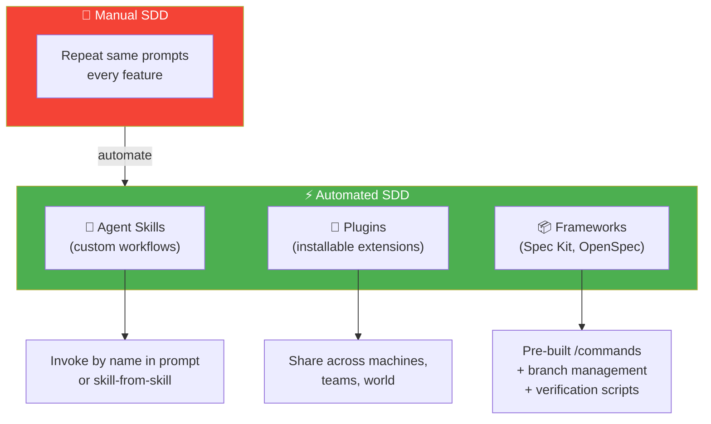
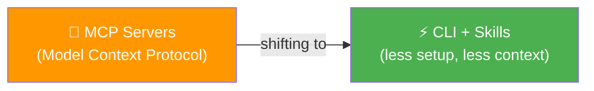
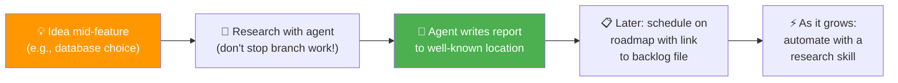

# 14 · Build Your Own Workflow ⚡

---

## 🎯 One Line

> **Automate your SDD with custom skills, plugins, and research backlogs.** Skills replace repeated prompts; MCP is shifting to CLI + Skills; and open-source frameworks like Spec Kit and OpenSpec can jumpstart your workflow.

---

## 🖼️ The Automation Landscape

> 💡 *Baar baar wahi prompt type kar raha hai? Skill bana de — ek baar likho, hamesha kaam aaye!* 🔁→⚡

---

## 🎯 Agent Skills — Deeper Dive

### Creating a Skill

| Step | Detail |
|------|--------|
| 1. Ask agent to use its **skill creator** | "Use your skill creator to talk through this" |
| 2. Agent asks follow-up questions | Usually quite good — interview format |
| 3. Submit responses | Agent proceeds to write the skill |
| 4. Watch the output | Is it making the choices you wanted? |
| 5. Review the skill | Written to a directory (per-project or global) |

### Invoking Skills

| Method | How |
|--------|-----|
| **Name it in your prompt** | "Using the feature-spec skill, plan the next feature" |
| **Skill-from-skill** | One skill calls another |
| **Progressive disclosure** | Agent reads skill description → decides when to call it automatically |

> ⚠️ **Progressive disclosure isn't always perfect** — especially as context window gets larger. If you know you want a skill, **name it explicitly**. Saves thinking tokens.

### Skill Scope

| Scope | Use When |
|-------|----------|
| **Per-project** | Skill is specific to this project's conventions |
| **Global** | Skill applies across all your projects |

---

## 🔄 MCP → CLI + Skills (The Trend)

| | MCP Servers | CLI + Skills |
|---|---|---|
| **Setup** | More complex | Less setup |
| **Context usage** | Higher | Lower |
| **Action** | Via protocol | CLI tools take action directly |
| **Trend** | Still popular but... | **Accelerating** adoption |

### Example: Context7

| Old Way | New Way |
|---------|---------|
| Context7 MCP server | Context7 **CLI + Skill** |
| Brings updated package docs into agent context | Same purpose, more elegant |
| E.g., React 9.0 → React 9.2 | Same — keeps agent up-to-date with latest versions |

---

## 🔌 Plugins & Frameworks

### Plugins (Agent Extensions)

| Aspect | Detail |
|--------|--------|
| **What** | Collection of agent extensions — installable and updatable |
| **Sharing** | Across machines, teammates, the world |
| **Growing community** | Free plugins available — check for SDD productivity boosts |
| **⚠️ Not cross-agent** | Plugins are NOT yet a standard across agents |
| **⚠️ Trust** | Like apps/dependencies, plugins execute code — trust on install AND update |

### Open-Source SDD Frameworks

| Framework | Commands / Workflow | Source |
|-----------|-------------------|--------|
| **GitHub Spec Kit** | `/constitution`, `/plan`, `/tasks`, `/implement` | GitHub |
| **OpenSpec** (Fission AI) | `propose → explore → apply → archive` | Fission AI |

| Spec Kit / OpenSpec Feature | Maps To Course Workflow |
|----------------------------|----------------------|
| Constitution / Propose | Constitution step |
| Plan / Explore | Feature spec planning |
| Tasks + Implement / Apply | Implementation |
| — / Archive | Replanning |
| Branch management | Feature branches |
| Verification scripts | Validation step |
| Opinionated spec formats | Constitution templates |

> Experiment with these open-source workflows to **refine your own**.

---

## 📝 Research Backlog Pattern

When you have an idea mid-feature but aren't committed yet:

| Step | Detail |
|------|--------|
| 1. Have an idea mid-feature | Don't stop your branch work |
| 2. Research with the agent | Conversation produces good ideas + questions |
| 3. Accept/reject recommendations | Change your mind on some — that's fine |
| 4. **Don't lose it** | Tell agent to write a report in a well-known location |
| 5. Schedule later | Ask agent to add it to roadmap with link to backlog file |
| 6. Scale with a skill | As research backlog grows, automate with a research skill |

---

## 🧪 Quick Check

❓ What are the three ways to invoke an agent skill?

1. **Name it in your prompt** — explicitly say "use X skill." 2. **Skill-from-skill** — one skill calls another. 3. **Progressive disclosure** — agent reads the skill description and decides when to call it automatically (but not always reliable).

❓ Why is the trend shifting from MCP servers to CLI + Skills?

CLI tools **take action with less setup and less context usage** compared to MCP servers. Tools like Context7 now suggest CLI + Skills over MCP as the primary integration method. The trend is accelerating.

❓ How do you handle research ideas that come up mid-feature?

Don't stop branch work. Research with the agent → tell it to write a **report in a well-known location** (backlog). Later, schedule it on the roadmap with a link to the backlog file. As the backlog grows, automate with a research skill.

---

> **Next →** [Agent Replaceability](15-agent-replaceability.md)
