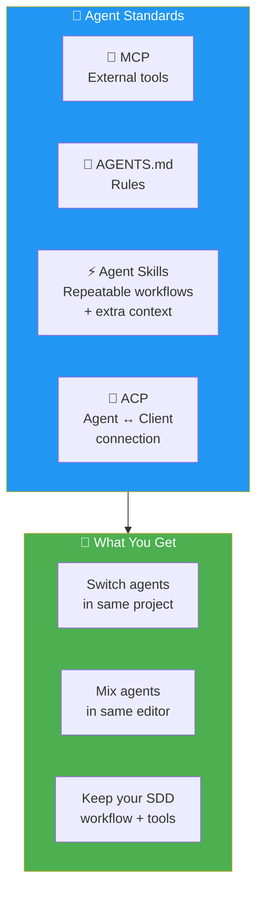
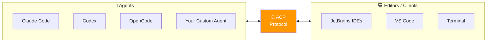

# 15 · Agent Replaceability 🔄

---

## 🎯 One Line

> **Specs work at a higher level — not tied to any one agent or IDE.** Standards like MCP, AGENTS.md, Agent Skills, and ACP let you switch agents while keeping your workflow.

---

## 🖼️ The Standards Stack

> 💡 *Agent change hoga, model change hoga — lekin tera spec nahi badlega. Yahi hai SDD ki taakat!* 💪

---

## 📐 Four Key Standards

| Standard | What It Does | Analogy |
|----------|-------------|---------|
| **MCP** (Model Context Protocol) | Connects agents to external tools (APIs, DBs, services) | USB ports for agents |
| **AGENTS.md** | Defines rules and conventions for agents in a project | README but for agent behavior |
| **Agent Skills** | Packages repeatable workflows with extra context | Reusable scripts/macros |
| **ACP** (Agent Client Protocol) | Connects agents to editors/clients | LSP but for AI agents |

---

## 🔌 ACP — Agent Client Protocol (Deep Dive)

| ACP Feature | Detail |
|-------------|--------|
| **Architecture** | Same pattern as LSP (Language Server Protocol) |
| **Registry** | Automates finding, installing, and connecting agents with clients |
| **Coverage** | More than just chat — includes Next Edit Suggestion, plan mode |
| **Custom agents** | Write your own → install locally in your tool |
| **Lifecycle** | Registry covers the whole lifecycle: discover → install → connect |

### Example: Adding OpenCode to JetBrains

| Step | What Happens |
|------|-------------|
| 1. AI Chat window → ACP Registry | IDE shows listing of compatible agents |
| 2. Click install | Automates installation of OpenCode + IDE integration |
| 3. Done | Native integration — use alongside other agents in same editor |

---

## 🔄 Switching Agents in Practice

| Scenario | How It Works |
|----------|-------------|
| **Claude Code → Codex** | Copy skills to Codex's path → runs fine once migrated |
| **Multiple agents in one project** | Switch back and forth, keeping your SDD workflow |
| **Different editors** | ACP makes agents work across editors |
| **New agent appears** | Check benchmarks → install via ACP → same specs work |

> Skills may need **path migration** between agents (stored in different locations), but the workflow itself transfers.

---

## 📊 Choosing Agents

| Aspect | Advice |
|--------|--------|
| **Industry changes fast** | Today's leader may not be tomorrow's |
| **Benchmark sites** | Leaderboards provide different evaluations — keep up to date |
| **Your criteria** | Base decisions on what matters to YOU, not just rankings |
| **SDD advantage** | Specs aren't tied to any agent → you can always switch |

---

## ⚠️ Key Takeaway

> **SDD moves work from the "how" to the "what and why."** Since the spec operates at a higher level than any specific agent, your workflow and tools remain independent. As more standards emerge, this flexibility will only grow.

---

> **Next →** [Conclusion](16-conclusion.md)
