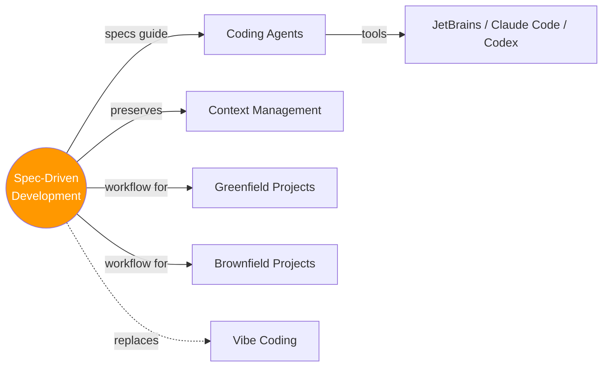

# 📋 Spec-Driven Development (SDD)

> Stop vibe-coding. Write the spec, let the agent code. You think, it types.

---

## 🧠 Brain — How This Connects

## 📊 Progress

| # | Lesson | Confidence | Revised |
|---|--------|-----------|---------|
| 01 | [Introduction](01-introduction.md) | 🟢 | — |
| 02 | [Why Spec-Driven Development?](02-why-sdd.md) | 🟢 | — |
| 03 | [Workflow Overview](03-workflow-overview.md) | 🟢 | — |
| 04 | [Set Up Your Environment](04-setup-environment.md) | 🔴 | — |
| 05 | [Setup](05-setup.md) | 🔴 | — |
| 06 | [Creating the Constitution](06-creating-the-constitution.md) | 🔴 | — |
| 07 | [Feature Specification](07-feature-specification.md) | 🔴 | — |
| 08 | [Feature Implementation](08-feature-implementation.md) | 🔴 | — |
| 09 | [Feature Validation](09-feature-validation.md) | 🔴 | — |
| 10 | [Project Replanning](10-project-replanning.md) | 🔴 | — |
| 11 | [The Second Feature Phase](11-second-feature-phase.md) | 🔴 | — |
| 12 | [The MVP](12-the-mvp.md) | 🔴 | — |
| 13 | [Legacy Support](13-legacy-support.md) | 🔴 | — |
| 14 | [Build Your Own Workflow](14-build-your-own-workflow.md) | 🔴 | — |
| 15 | [Agent Replaceability](15-agent-replaceability.md) | 🔴 | — |
| 16 | [Conclusion](16-conclusion.md) | 🔴 | — |

**Overall: 3/16 lessons done**

## 🧩 Memory Fragments

> Things picked up over time. Random "aha!" moments, project learnings.
> 
> - 💡 SDD = "3 min thinking saves 30 min of agent chaos" — the ROI is insane
> - 💡 Specs aren't just prompts — they're a **constitution** for the project
> - 💡 Works for both greenfield AND brownfield — not just new projects

---

## 🎬 Teach Mode — Lesson Flow

> Open these in order = you can teach anyone SDD

| # | Lesson | One-liner | Time |
|---|--------|-----------|------|
| 01 | [Introduction](01-introduction.md) | What is SDD & why it beats vibe coding | 4 min |
| 02 | [Why SDD?](02-why-sdd.md) | The case for specs over freestyle | 4 min |
| 03 | [Workflow Overview](03-workflow-overview.md) | Constitution → feature loops → verify | 3 min |
| 04 | [Setup Environment](04-setup-environment.md) | Tools & environment prep | 5 min |
| 05 | [Setup](05-setup.md) | Getting started | 1 min |
| 06 | [Constitution](06-creating-the-constitution.md) | Define immutable project standards | 10 min |
| 07 | [Feature Spec](07-feature-specification.md) | Write the spec for a feature | 3 min |
| 08 | [Feature Impl](08-feature-implementation.md) | Agent implements the spec | 1 min |
| 09 | [Feature Validation](09-feature-validation.md) | Verify what was built | 4 min |
| 10 | [Replanning](10-project-replanning.md) | Adapt between features | 6 min |
| 11 | [Second Feature](11-second-feature-phase.md) | Iterate the loop again | 6 min |
| 12 | [The MVP](12-the-mvp.md) | Putting it all together | 3 min |
| 13 | [Legacy Support](13-legacy-support.md) | SDD on existing codebases | 4 min |
| 14 | [Own Workflow](14-build-your-own-workflow.md) | Custom agent skills | 6 min |
| 15 | [Replaceability](15-agent-replaceability.md) | Agent-agnostic specs | 3 min |
| 16 | [Conclusion](16-conclusion.md) | Wrap up | 1 min |

---

## 📚 Sources

> - 🎓 Course: [Spec-Driven Development with Coding Agents](https://learn.deeplearning.ai/courses/spec-driven-development-with-coding-agents/) — DeepLearning.AI × JetBrains
> - 👨‍🏫 Instructor: Paul Everitt (Developer Advocate, JetBrains)
> - 🎤 Intro by: Andrew Ng

## 🔗 Connected Topics

> → [Agentic AI](../agentic-ai/) · [RAG](../rag/) · [System Design](../system-design/)

## 30-Second Recall 🧠

> **Spec-Driven Development** = write a markdown spec (what to build, constraints, architecture) → feed it to a coding agent → agent implements it. Three wins: **downstream amplification** (one spec line → hundreds of code lines), **context preservation** (agents are stateless, specs aren't), **intent fidelity** (you define the problem, agent elaborates). Workflow: write a **project constitution** (immutable standards) → iterate **feature loops** (plan → implement → verify) on branches → clean slate between features. Works on greenfield AND brownfield.
