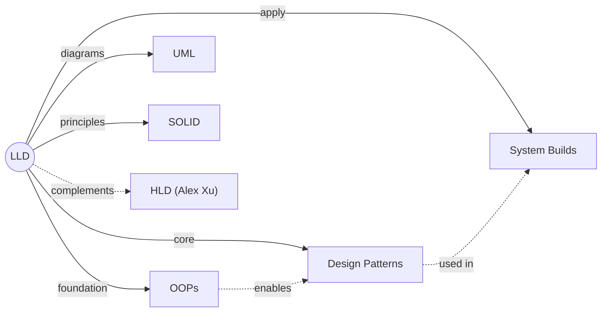

# 🏗️ System Design — LLD (Low-Level Design)

> Real-world applications kaise banti hain? OOPs, Design Patterns, and building actual systems from scratch.

---

## 🧠 Brain — How This Connects

## 📊 Progress

### Part 1: Foundations (OOPs, UML, SOLID)

| # | Lesson | Video | Confidence | Revised |
|---|--------|-------|-----------|---------|
| 01 | [Introduction to System Design](01-introduction.md) | [Video](https://www.youtube.com/watch?v=AK0hu0Zxua4) | 🔴 | — |
| 02 | [OOPs: Abstraction & Encapsulation](02-oops-abstraction-encapsulation.md) | [Video](https://www.youtube.com/watch?v=QbGoqAgP_zg) | 🔴 | — |
| 03 | [OOPs: Inheritance & Polymorphism](03-oops-inheritance-polymorphism.md) | [Video](https://www.youtube.com/watch?v=KGOEK0-XBIg) | 🔴 | — |
| 04 | [UML Diagrams](04-uml-diagrams.md) | [Video](https://www.youtube.com/watch?v=nPJyyO9pb5s) | 🔴 | — |
| 05 | [SOLID Principles Part 1](05-solid-part1.md) | [Video](https://www.youtube.com/watch?v=UsNl8kcU4UA) | 🔴 | — |
| 06 | [SOLID Principles Part 2](06-solid-part2.md) | [Video](https://www.youtube.com/watch?v=hU9koy6A2I0) | 🔴 | — |

### Part 2: Design Patterns

| # | Lesson | Pattern | GoF Category | Video | Confidence | Revised |
|---|--------|---------|-------------|-------|-----------|---------|
| 08 | [Strategy Pattern](08-strategy-pattern.md) | Strategy | Behavioral | [Video](https://www.youtube.com/watch?v=PpKvPrl_gRg) | 🔴 | — |
| 09 | [Factory Pattern](09-factory-pattern.md) | Factory | Creational | [Video](https://www.youtube.com/watch?v=dMK4TbG29fk) | 🔴 | — |
| 10 | [Singleton Pattern](10-singleton-pattern.md) | Singleton | Creational | [Video](https://www.youtube.com/watch?v=CD3meit-WDc) | 🔴 | — |
| 12 | [Observer Pattern](12-observer-pattern.md) | Observer | Behavioral | [Video](https://www.youtube.com/watch?v=Jpmp4GY8r3Q) | 🔴 | — |
| 13 | [Decorator Pattern](13-decorator-pattern.md) | Decorator | Structural | [Video](https://www.youtube.com/watch?v=Z9rFlZClYNI) | 🔴 | — |
| 15 | [Command Pattern](15-command-pattern.md) | Command | Behavioral | [Video](https://www.youtube.com/watch?v=cnQZsN0jxEY) | 🔴 | — |
| 16 | [Adapter Pattern](16-adapter-pattern.md) | Adapter | Structural | [Video](https://www.youtube.com/watch?v=FV3x69rpwm0) | 🔴 | — |
| 17 | [Facade Pattern](17-facade-pattern.md) | Facade | Structural | [Video](https://www.youtube.com/watch?v=0KlnSdvsojc) | 🔴 | — |
| 19 | [Composite Pattern](19-composite-pattern.md) | Composite | Structural | [Video](https://www.youtube.com/watch?v=xaaiMGmyDJk) | 🔴 | — |
| 20 | [Template Method](20-template-method.md) | Template Method | Behavioral | [Video](https://www.youtube.com/watch?v=8-vE_bmEt18) | 🔴 | — |
| 21 | [Proxy Pattern](21-proxy-pattern.md) | Proxy | Structural | [Video](https://www.youtube.com/watch?v=xuT6OOYVJTQ) | 🔴 | — |
| 22 | [Chain of Responsibility](22-chain-of-responsibility.md) | Chain of Responsibility | Behavioral | [Video](https://www.youtube.com/watch?v=LXVKB6deQMo) | 🔴 | — |
| 25 | [Bridge Pattern](25-bridge-pattern.md) | Bridge | Structural | [Video](https://www.youtube.com/watch?v=KVf8dwgTbiM) | 🔴 | — |
| 28 | [Builder Pattern](28-builder-pattern.md) | Builder | Creational | [Video](https://www.youtube.com/watch?v=G4Ntl9KzIxY) | 🔴 | — |
| 29 | [Iterator Pattern](29-iterator-pattern.md) | Iterator | Behavioral | [Video](https://www.youtube.com/watch?v=30fveBRLqMw) | 🔴 | — |
| 30 | [Flyweight Pattern](30-flyweight-pattern.md) | Flyweight | Structural | [Video](https://www.youtube.com/watch?v=vNSRcegCO8E) | 🔴 | — |
| 32 | [State Pattern](32-state-pattern.md) | State | Behavioral | [Video](https://www.youtube.com/watch?v=bJPmvie_p4w) | 🔴 | — |
| 35 | [Mediator Pattern](35-mediator-pattern.md) | Mediator | Behavioral | [Video](https://www.youtube.com/watch?v=3lGIICzgyQQ) | 🔴 | — |
| 36 | [Prototype Pattern](36-prototype-pattern.md) | Prototype | Creational | [Video](https://www.youtube.com/watch?v=KMQFNV8LFec) | 🔴 | — |
| 38 | [Visitor Pattern](38-visitor-pattern.md) | Visitor | Behavioral | [Video](https://www.youtube.com/watch?v=DnmsxnlCyl0) | 🔴 | — |
| 39 | [Memento Pattern](39-memento-pattern.md) | Memento | Behavioral | [Video](https://www.youtube.com/watch?v=p8-ile_nWnY) | 🔴 | — |
| 40 | [Null Object Pattern](40-null-object-pattern.md) | Null Object | Anti-Pattern | [Video](https://www.youtube.com/watch?v=iXHlc_S3Ae4) | 🔴 | — |

### Part 3: System Builds (LLD Projects)

| # | Lesson | System | Video | Confidence | Revised |
|---|--------|--------|-------|-----------|---------|
| 07 | [Build Google Docs](07-build-google-docs.md) | Document Editor | [Video](https://www.youtube.com/watch?v=MT9qZFGQXOU) | 🔴 | — |
| 11 | [Build Zomato](11-build-zomato.md) | Food Delivery App | [Video](https://www.youtube.com/watch?v=2SAUqTn3TrU) | 🔴 | — |
| 14 | [Build Notification Engine](14-build-notification-engine.md) | Notification System | [Video](https://www.youtube.com/watch?v=t-4r2AsJz_Q) | 🔴 | — |
| 18 | [Build Spotify](18-build-spotify.md) | Music Player | [Video](https://www.youtube.com/watch?v=DkLwFqbCsu8) | 🔴 | — |
| 23 | [Build Payment Gateway](23-build-payment-gateway.md) | Payment System | [Video](https://www.youtube.com/watch?v=36FDqIRBGRg) | 🔴 | — |
| 24 | [Build Discount Engine](24-build-discount-engine.md) | Coupon System | [Video](https://www.youtube.com/watch?v=jbVevoGN_pM) | 🔴 | — |
| 26 | [Build Zepto](26-build-zepto.md) | Quick Commerce | [Video](https://www.youtube.com/watch?v=FcbsppIX0bg) | 🔴 | — |
| 27 | [Build Tinder](27-build-tinder.md) | Dating App | [Video](https://www.youtube.com/watch?v=IcgLSo6--ok) | 🔴 | — |
| 31 | [Build Splitwise](31-build-splitwise.md) | Expense Splitting | [Video](https://www.youtube.com/watch?v=cWtBZUAQpcc) | 🔴 | — |
| 33 | [Build Tic Tac Toe](33-build-tic-tac-toe.md) | Game | [Video](https://www.youtube.com/watch?v=BGFzYjGtRP4) | 🔴 | — |
| 34 | [Build Snake & Ladder](34-build-snake-ladder.md) | Game | [Video](https://www.youtube.com/watch?v=1NJB54UB8nE) | 🔴 | — |
| 37 | [Build Chess](37-build-chess.md) | Game | [Video](https://www.youtube.com/watch?v=eULHvaMZUks) | 🔴 | — |

---

## 📚 Sources

- 🎬 [System Design Full Course - Concept && Coding (Coder Army)](https://www.youtube.com/playlist?list=PLQEaRBV9gAFvzp6XhcNFpk1WdOcyVo9qT) — 40 videos
- 📖 Gang of Four (GoF) — Design Patterns: Elements of Reusable Object-Oriented Software
- 💻 [Code repo](https://github.com/kanmaytacker/design-questions) — Java implementations

## 🔗 Connected Topics

> → [HLD (Alex Xu)](../system-design-hld/) (planned) · [DSA](../dsa/) (planned) · [Agentic AI](../agentic-ai/) (design patterns apply to agent architectures!)

## 30-Second Recall 🧠
> _Will be written after first few lessons are filled._
